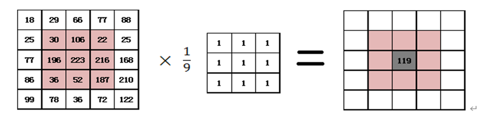
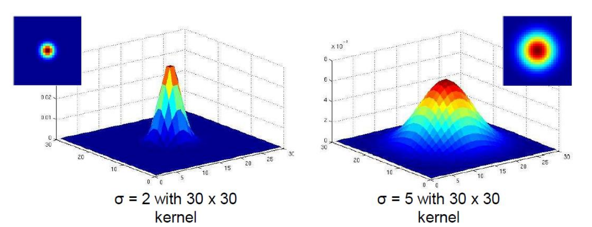

[toc]

## 一、线性滤波

### 1. 图像滤波

**图像滤波：**利用函数或算子对某像素的局部邻域进行计算以达到修改其像素值的一种图像处理方法。

<u>**卷积 = 滤波 = 加权求和！**</u>

**滤波结果：**滤波形成一幅新的图像，其像素值是原始图像像素值的点运算的结果。

### 2. 线性滤波

**线性滤波：**利用相邻像素的线性组合 (加权和) 代替原始像素的值，主要包括**互相关与卷积**。

#### 2.1 互相关

**相关：**将图像记为 F， 以H表示权重核(大小为(2K+1)x(2K+ 1)，即**奇数**)， 并记G为输出图像，则：
$$
G[i,j]=\sum_{u=-k}^{k}\sum_{v=-k}^{k}H[u,v]F[i+u,j+v]
$$
相关操作可理解为图像局部邻域像素与权重核之间的**点乘积**，可表示为：$G=H\otimes F$.
#### 2.2 卷积

**卷积：**只需将权重核进行**180度旋转**(水平和垂直翻转)：
$$
G[i,j]=\sum_{u=-k}^{k}\sum_{v=-k}^{k}H[u,v]F[i-u,j-v]
$$
上式成为卷积操作，可表示为：$G=H*F$.
#### 2.3 卷积的性质

- 交换律：$H∗F=F∗H$
- 分配律：$(H+F)∗G=H∗G+F∗G$
- 结合律：$(H∗F)∗G=H∗(F∗G)$
- 常数可以外提：$ka*b=a*kb=k(a*b)$
- 一个滤波器与一个**单位冲激**(单位核，中间为1，四周都是0)做卷积运算等于它自己：$a*e=a$

### 3. 常见滤波

#### 3.1 均值滤波

滤波结果的像素值是任意一个点的**邻域平均值**，该像素值等于各邻域像素值之和除以领域面积。卷积核**越大**，去噪效果**越好**，但是花费的计算**时间就越长**，同时图像**失真越严重**。在实际处理中，要在失真和去噪效果之间取得平衡，选取合适大小的卷积核。
$$
Kernel=\frac{1}{M\times N}{
\begin{bmatrix}
1 & 1 & 1 & \cdots & 1 \\
1 & 1 & 1 & \cdots & 1 \\
\cdots & \cdots & \cdots & \cdots & \cdots \\
1 & 1 & 1 & \cdots & 1 \\
1 & 1 & 1 & \cdots & 1
\end{bmatrix}}^{\leftarrow}
$$

#### 3.2 方框滤波

在方框滤波中，可以自由选择是否对均值滤波的结果进行归一化，即可以自由选择滤波结果是**邻域像素值之和的平均值**，还是**邻域像素值之和**。在OpenCV中实现方框滤波过程中，当参数normalize = 1时，结果与均值滤波相同。当参数normalize = 0时，处理后的图片接近纯白色，部分点出有颜色。这是由于**目标像素点的值是卷积核范围内像素点像素值的和**，此时的核为：
$$
Kernel=
\begin{bmatrix}
1 & 1 & 1 & \cdots & 1 \\
1 & 1 & 1 & \cdots & 1 \\
\cdots & \cdots & \cdots & \cdots & \cdots \\
1 & 1 & 1 & \cdots & 1 \\
1 & 1 & 1 & \cdots & 1
\end{bmatrix}
$$

#### 3.3 高斯滤波

利用高斯滤波函数对图像进行卷积，其中高斯函数(核心参数为**标准差和方差)**：
$$
G_{\sigma}=\frac{1}{2\pi\sigma^{2}}e^{-\frac{(x^{2}+y^{2})}{2\sigma^{2}}}
$$

高斯滤波加起来的**和等于 1**，不等于 1 会整体隆低或提高图像亮度。

通常将高斯滤波器的半宽设置为$3\sigma$。例：若$\sigma=1$，则滤波器的尺寸应为$7×7$。(利用方差表示宽度) 故方差决定了滤波器的平滑程度，**方差越大，滤波器越平滑**。

***高斯滤波的可分离性***

我们可以将一个**标准差较大**的高斯核，分解为**多个标准差较小**的高斯核做多次卷积操作以得到同一结果。
例：对一个标准差为**$\sigma$**的高斯核做**两次**卷积操作，与对一个标准差为$\sqrt{2}\sigma$的高斯核做**一次**卷积操作的结果是等价的。($\sigma_1^2+\sigma_2^2=\sigma_3^2$ )

一个**二维高斯核**可以分解为两个**一维的高斯核**先后进行计算。例：
$$
\begin{aligned}
G_{\sigma}(x,y) & =\quad\frac{1}{2\pi\sigma^2}e^{-\frac{x^2+y^2}{2\sigma^2}} \\
 & =\quad\left(\frac{1}{\sqrt{2\pi}\sigma}e^{-\frac{x^2}{2\sigma^2}}\right)\left(\frac{1}{\sqrt{2\pi}\sigma}e^{-\frac{y^2}{2\sigma^2}}\right)
\end{aligned}
$$

对于$N×N$的图像和$M×M$的卷积核，其原始计算复杂度为$O(n^2m^2)$，分离后的复杂度为$O(n^2m)$。

### 4. 常见噪音及其对应的去噪方法

- **椒盐噪声**(随机找地方放黑点或白点)--**中值滤波**，不能用高斯滤波。
- **高斯噪声**(均值为0的正态分布噪声)-**高斯滤波**。
- **脉冲噪声**(随即找地方放白点)--**中值滤波**。
- 在均值滤波器中，由于噪声成分被放入平均计算中，所以输出受到了噪声的影响，但是在中值滤波器中，由于噪声成分很难选上，所以几乎不会影响到输出，故**中值滤波对局外点更为鲁棒**，若需要保持原有信号形状可以使用中值滤波。

### 5. 锐化

通过原始图片**减去低频信息**得到**高频的细节信息**，再加原始图像与细节**相加**得到**锐化图像**：
$$
\begin{aligned}
F + \alpha (F - F \ast H) 
  &= (1 + \alpha) F - \alpha (F \ast H) \\
  &= F(1 + \alpha) \ast e - F \ast \alpha H \\
  &= F \ast [(1+\alpha)e - \alpha H]
\end{aligned}
$$

其中$F$为**图像**，$F\ast H$为经**滤波器模糊后的图像**，$e$为**单位冲激**(单位核，中间为1，四周都是0)。

## 二、边缘检测

### 1. 边缘的产生原因与特征

边缘是由表面**亮度、颜色、深度等不连续性**产生的，是图像的强度**函数快速变化**的区域。

### 2. 二维图像的梯度

对于**离散**的数字图像$f(x,y)$，点$(x,y)$处的对$x$的**导数**可以写成以下公式：
$$
\frac{\partial f(x,y)}{\partial x}\approx\frac{f(x+1,y)-f(x,y)}{1}
$$
同理，点$(x,y)$处的对$y$的**导数**可以写成以下公式：
$$
\frac{\partial f(x,y)}{\partial y}\approx\frac{f(x,y+1)-f(x,y)}{1}
$$
如果要使用**卷积**来实现以上操作，则$\frac{\partial f(x,y)}{\partial x}$对应的滤波器为$\begin{bmatrix} -1 & 1\end{bmatrix}$，$\frac{\partial f(x,y)}{\partial y}$对应的滤波器为$\begin{bmatrix} 1  \\  -1  \end{bmatrix}$。

故对于一张图像任意一点的**梯度**为：$\nabla f=
\begin{bmatrix}
\frac{\partial f}{\partial x},\frac{\partial f}{\partial y}
\end{bmatrix}$。梯度的方向指向图像**强度函数增长最快**的方向，即**边缘**的方向。**梯度的方向**可以用如下公式表示：$\theta=\tan^{-1}
\begin{pmatrix}
\frac{\partial f}{\partial y}/\frac{\partial f}{\partial x}
\end{pmatrix}$。**边缘强度**可以由**梯度幅值**给出：
$$
\left\|\nabla f\right\|=\sqrt{\left(\frac{\partial f}{\partial x}\right)^2+\left(\frac{\partial f}{\partial y}\right)^2}
$$

### 3. 常用的边缘检测算子

#### 3.1 Roberts 算子

**滤波器：**
$$
G_x = \begin{bmatrix}
1 & 0 \\
0 & -1 
\end{bmatrix}, \quad 
G_y = \begin{bmatrix}
0 & 1 \\
-1 & 0 
\end{bmatrix}
$$
**梯度的计算公式：**
$$
\begin{aligned}
G_x(i,j) &= f(i,j) \cdot 1 + f(i+1,j+1) \cdot (-1) \\
G_y(i,j) &= f(i,j+1) \cdot 1 + f(i+1,j) \cdot (-1) \\
\\
G(i,j) &= \sqrt{G_x^2(i,j) + G_y^2(i,j)} \\
&\approx |G_x(i,j)| + |G_y(i,j)|
\end{aligned}
$$

#### 3.2 Prewitt 算子

**滤波器：**
$$
G_x = \begin{bmatrix}
-1 & 0 & 1 \\
-1 & 0 & 1 \\
-1 & 0 & 1 
\end{bmatrix}, \quad 
G_y = \begin{bmatrix}
-1 & -1 & -1 \\
0 & 0 & 0 \\
1 & 1 & 1 
\end{bmatrix}
$$
**梯度的计算公式：**
$$
\begin{aligned}
G_x(i,j) &= \sum_{k=i-1}^{i+1} \sum_{l=j-1}^{j+1} f(k,l) \cdot K_x(k-i+2,l-j+2) \\
G_y(i,j) &= \sum_{k=i-1}^{i+1} \sum_{l=j-1}^{j+1} f(k,l) \cdot K_y(k-i+2,l-j+2) \\
\\
G(i,j) &= \sqrt{G_x^2(i,j) + G_y^2(i,j)} \\
&\approx |G_x(i,j)| + |G_y(i,j)|
\end{aligned}
$$

#### 3.3 Sobel 算子

**滤波器：**
$$
G_x = \begin{bmatrix}
-1 & 0 & 1 \\
-2 & 0 & 2 \\
-1 & 0 & 1 
\end{bmatrix}, \quad 
G_y = \begin{bmatrix}
-1 & -2 & -1 \\
0 & 0 & 0 \\
1 & 2 & 1 
\end{bmatrix}
$$
**梯度的计算公式**：
$$
\begin{aligned}
G_x(i,j) &= [f(i-1,j+1) + 2f(i,j+1) + f(i+1,j+1)] \\
&\quad - [f(i-1,j-1) + 2f(i,j-1) + f(i+1,j-1)] \\
\\
G_y(i,j) &= [f(i+1,j-1) + 2f(i+1,j) + f(i+1,j+1)] \\
&\quad - [f(i-1,j-1) + 2f(i-1,j) + f(i-1,j+1)] \\
\\
G(i,j) &= \sqrt{G_x^2(i,j) + G_y^2(i,j)} \\
&\approx |G_x(i,j)| + |G_y(i,j)|
\end{aligned}
$$

### 4. 噪音对边缘检测的影响及解决方法

图像中的**噪声对导数运算极其敏感**，直接对图像求导会**放大噪声**，导致结果无法使用。

通常有两种做法：1.先用高斯核去噪，再差分；2.对高斯核进行差分，得到差分核。

#### 4.1 先进行平滑操作

查找$\frac{d}{dx}(f*g)$的**最大值**，$f$为原始图像，$g$为滤波器。

**高对比处的点的绝对值较高。**

#### 4.2 差分核

根据卷积的**微分性质**，我们有：
$$
\frac{d}{dx}(f*g)=f*\left(\frac{dg}{dx}\right)
$$
*这意味着：函数$f$与微分器$\frac{dg}{dx}$的卷积，等价于函数$f$与核$g$的卷积结果的导数，这里的$f$是图像，$g$是高斯核$G(\sigma)$。*

这个性质使得我们不需要**先平滑再求导**(两步操作)，只需要用预先计算的导数核$\frac{dG}{dx}$对图像 *f* 做一次卷积操作即可**同时实现平滑和求导**。
差分核加起来的**和应为0**，保证其对**连续区域**不会有响应(正负抵消)。

参数 *σ* 定义了高斯核及其导数核的“尺度”。大 *σ* 对应大的平滑核，检测大的、模糊的边缘或结构（但对噪声抑制效果好）；小 *σ* 对应小的平滑核，检测精细的、锐利的边缘或结构（但对噪声更敏感）。 

### 5. Canny边缘检测算法

- **灰度化处理：**将输入的彩色图像转换为灰度图像。灰度化是为了简化后续处理，只需考虑图像的亮度信息，而不考虑颜色信息。
- **高斯滤波：**使用高斯滤波器对灰度图像进行平滑处理，以减少噪声。
- **计算图像梯度：**用 Sobel 算子或其他边缘检测算子计算灰度图像在水平和垂直方向的梯度值。根据这些梯度值可以计算出**每个像素点的梯度强度和方向**。
- **进行非极大值抑制：**这⼀步的目的是“瘦”边，即为了**解决筛选出的边缘存在过粗的问题**。通过比较每个像素点在其梯度方向(只保留8个梯度方向)上的邻近像素点的梯度值，**只保留局部梯度值最大的像素点作为边缘点，**其他像素点则被抑制。

- **使用双阈值检测与边缘连接**：使用双阈值（高阈值和低阈值）将像素点分为三类：**强边缘、弱边缘和非边缘**。高于**高阈值的像素点被分类为强边缘，低于低阈值的被分类为非边缘，介于两者之间的被分类为弱边缘**。然后，如果**弱边缘像素的某个邻域像素是强边缘像素，则该弱边缘像素被保留为真实的边缘**。

  

## 三、拟合

### 1. 拟合存在的挑战

数据噪声、多余的数据(干扰信息)、数据遮挡。

### 2. 最小二乘法线性拟合

- **数据：$(x_1,y_1),...,(x_n,y_n)$.**
- **线性方程：$y=mx+b$.**
- **目标函数：$E=\sum_{i=1}^n(y_i-mx_i-b)^2$** **(损失值为散点到拟合曲线的 Y 方向的距离)**
- **算法目标：找到使得目标函数$E$最小的$(m,b)$组合.**

将目标函数的标量替换为**向量**：
$$
Y=
\begin{bmatrix}
y_1 \\
\vdots \\
y_n
\end{bmatrix}\quad X=
\begin{bmatrix}
x_1 & 1 \\
\vdots & \vdots \\
x_n & 1
\end{bmatrix}\quad B=
\begin{bmatrix}
m \\
b
\end{bmatrix}
$$
即$Y=XB$。我们可以将目标函数$E$**向量化**为以下形式：
$$
\begin{aligned}
E&=
\begin{Vmatrix}
Y-XB
\end{Vmatrix}^2=(Y-XB)^T(Y-XB)\\
&=(Y^T-(XB)^T)(Y-XB)=(Y^T-B^TX^T)(Y-XB)\\
&=Y^TY-B^TX^TY-Y^TXB+(XB)^TXB=Y^{T}Y-2(XB)^{T}Y+(XB)^{T}(XB)
\end{aligned}
$$
对参数B求导：
$$
\frac{dE}{dB}=2X^TXB-2X^TY=0
$$
若$X$可逆，则最终结果为：$B=X^{-1}Y$.

*最小二乘法的缺点：没有旋转不变性；垂直于 X 轴的时候，曲线无法拟合；*

### 3. 全最小二乘法

优化的时候，**损失值是散点到拟合直线的距离**，目标是找到可以使目标函数最小的$(a,b,d)$。

- 线性方程：$ax+by=d\quad s.t.\quad (a^2+b^2=1)$.
- 目标函数：$E=\sum_{i=1}^{n}(ax_{i}+by_{i}-d)^{2}$**(点到直线距离公式)**.

过程太复杂了，推公式略……

**优点：具有旋转不变性；缺点：对噪声点敏感。**

### 4. 鲁棒最小二乘

通过设定⼀个**参数**，当点离直线的**距离**超过⼀定的**阈值**时，对这个点产生的**惩罚进行约束**，其公式为：
$$
\sum_i\rho(r_i(x_i,\theta);\sigma)
$$
其中$r_i(x_i,\theta)$为参数为$\theta$的模型在第$i$个点上的残差(即**散点到拟合直线的距离**)。$\rho$为**尺度参数**为$\sigma$的鲁棒函数：
$$
\rho(u;\sigma)=\frac{u^2}{\sigma^2+u^2}
$$
可以看出当 σ **越大**，允许的距离就**越大**。

*缺点是**对** **σ** **敏感，不合适的** **σ** **对拟合效果产生巨大影响。**太小的话全是局外点，拟合的直线**随机性太大**；太大的话没有局外点了，使拟合的直线**偏向局外***。

### 5. 随机采样一致性（RANSAC）

在存在异常值的情况下进行模型拟合的非常通用的框架。

初始化参数：

- **模型类型：** 需要拟合的模型（如直线：ax + by + c = 0）
- **最小样本大小 `s`：** 拟合模型所需的最少数据点数。
- **内点阈值 `t`：** 判断一个点是否为内点的距离阈值。通常基于数据性质和应用需求设定（如像素误差）。
- **期望外点比例 `e`：** 预估数据集中外点所占比例（在迭代过程中不断更新）。
- **成功概率 `p`：** 希望算法有 `p` 的概率至少找到一组没有离群点的样本（通常设为 0.99）。
- **最大迭代次数 `N` (初始估算)：** 基于 `p`、`e` 和 `s` 计算初始值：

$$
(1-(1-e)^s)^N=1-p\\
N=\frac{\log{(1-p)}}{\log{(1-(1-e)^{s})}}
$$

***这个公式基于概率：在迭代 N 次后，至少抽到一个只包含内点的子集的概率大于等于 p。随着迭代进行，会动态更新 N。***

具体步骤如下：

- 重复$N$次：

  - 随机抽取$s$个点：从数据集中随机均匀地抽取$s$个点(如果任务是拟合直线，那么$s$就是 2)。

  - 拟合模型：使用这$s$个点来拟合⼀条直线。

  - 找内点：在剩余的点中，找到与这条直线的距离小于$t$的点，这些点被称为内点($t$是距离阈值)。
  - 验证内点数量： 如果内点的数量大于或等于$d$，则接受这条直线，并使用所有内点重新拟合直线($d$是数量阈值)。
- 最终使用**最佳内点集**（即内点数量最多的模型）中的所有内点，**重新拟合**一个最终的、更精确的模型（例如，使用最小二乘法）。

**优点：**鲁棒性强。RANSAC 能够在数据中包含大量离群点（outliers）的情况下，仍然准确地估计模型参数。
**缺点：**参数选择敏感。RANSAC 的性能依赖于参数的选择，如迭代次数、内点阈值等。如果参数选择不当，可能会导致模型估计不准确或计算效率低下。

***自适应RANSAC***

外点比例$e$在一开始通常是未知的，故我们先假设**最坏的情况**，如：0.5，并在后续迭代过程中进一步调整。具体过程如下：

- 设置初始样本数 $N=\infty$ 和样本计数 sample_count = 0。
- 当 $N$ > sample_count 时，进行以下步骤：
  - 选择⼀个样本，并统计内点数量。
  - 计算新的外点率$e=1-\frac{\text{number of inliers}}{\text{total number of points}}$。
  - 根据新的$e$重新计算$N=\log\left(1-p\right)/\log\left(1-\left(1-e\right)^s\right)$。
  - 增加样本计数 sample_count += 1。

优点：**简单、能有效解决多种问题、计算效率更高、减少参数调整**；缺点：**对初始参数敏感、需要调整的参数较多、当问题很复杂，内点率很低时，算法需要的迭代次数很多，甚至无法结束**。

## 四、霍夫变换

霍夫变换可以**拟合多个模型**，RANSAC只能拟合一个模型。霍夫变换引入了一个很重要的思想，即**投票法**：

- 让每个特征对所有与之兼容的模型进行投票；
- 通常情况下噪声不会一致投票给任何单一模型；
- 缺失数据是可以接受的，只要还有足够的特征可以用来确定一个好的模型。

### 1. 参数空间表征

图像空间(笛卡尔坐标系)中的一条**线**($y=mx+b$)，对应到霍夫空间上是一个**点**$(m,b)$：

图像空间(笛卡尔坐标系)中的一个**点**$(x_0,y_0)$，对应到霍夫空间则是一条**线**($b=-x_0 m+y_0$)。若有$n$个点，则对应$n$条线，本质一样。

但是如果使用笛卡尔坐标系作为参数空间会有两个问题：参数的可行域不存在上下限；对于竖直的直线，$m$趋向于$\infin$。

故**改用极坐标表示：** 一条直线可以用两个参数 `ρ (rho)` 和 `θ (theta)` 唯一确定：
$$
x\cos\theta+y\sin\theta=\rho
$$

- `ρ`: 直线到图像原点（通常是左上角）的垂直距离（带符号）。原点在左上角时，`ρ` 可以是负值（常见实现会取绝对值后调整θ范围）。

- `θ`: 该垂线与x轴正方向的夹角（0~180度，或0~π弧度）。
- *可视化理解：* `θ` 可以看作是直线法线（垂直于直线的线）与x轴的夹角。`ρ` 是这条法线从原点到直线的长度。
- 图像空间中的每一个点 `(x, y)` 对应着参数空间 `(ρ, θ)` 中的一条**正弦曲线**：

$$
\rho(\theta)=x_ocos(\theta)+y_0sin(\theta)
$$

### 2. 霍夫变换算法流程

- 对图像执行边缘检测（例如Canny），得到一个二值边缘图像。
- 初始化累加器$H$全为0
- **遍历每个边缘点 $(x, y)$：**
  - 遍历所有可能的 `θ` 值（在离散化的范围内，例如0°到179°，每次+1°）。
  - 对于每一个$\theta_i$，利用公式$\rho=x\cos\theta+y\sin\theta$计算对应的$\rho_j$。
  - 在累加器数组$H(\rho_j,\theta_i)$上加1。
- 寻找累加器空间中的局部最大值对应的直线参数。
- 将检测到的直线绘制在原始图像上。

**优点**：能够处理遮挡等情况；可以同时输出多个模型；
**缺点**：当模型参数增加时，搜索空间将变得越来越复杂；很难获得合适的参数离散化霍夫空间；**在参数空间维度较高时（4 维以上），霍夫变换的计算复杂度很高**。

## 五、角点

### 1. 角点（特征点）

**角点（Corner）** 指的是图像中在两个或多个方向上灰度/颜色发生剧烈变化的点。它代表了图像中局部区域的重要特征点（特征点）。一个角点通常位于图像中物体边缘的交叉点或转折点处。

特征点提取的作用：**图像匹配、3D重建、运动跟踪、机器人导航等**。

特征点的属性：**重复性、显著性、局部性、紧凑性和效率**。

### 2. Harris算法

我们可以通过一个**小窗口**来识别目标点，对于角点来说，**在任意方向上移动小窗口都会导致像素幅值的显著改变。**Harris算法的核心是分析图像中每一个**候选像素点 `(x, y)` 周围的一个小的局部窗口**。

接下来，我们来用数学公式描述它：
$$
E(u,v)=\sum_{(x,y)}w(x,y)[I(x+u,y+v)-I(x,y)]^2
$$
$E(u,v)$是对窗口里的每个内容求和，故$(x,y)$为窗口的宽度和高度。其中$I(x,y)$为对应坐标系下像素点的幅值，$(u,v)$为窗口的偏移量。公式后半段就表示了偏移前后像素点之间的差异大小。

$w(x,y)$为**窗口函数**，也可以看作为一个权值，若每个像素重要性一致，则可以直接使用**方窗**；若希望中间点的权重更大（**判断中间点是否为角点**），则可以使用**高斯窗**，考虑每个点的差异值对总评价的贡献。

如果我们想**直接建立**$(u,v)$到$E(u,v)$的关系(跳过取像素点数值的过程)，在$(0,0)$的领域区间内($u,v$较小)，我们可以对$E(u,v)$进行**二阶二维泰勒展开**：
$$
E(u,v)\approx E(0,0)+[u,v]
\begin{bmatrix}
E_{u}(0,0) \\
E_{v}(0,0)
\end{bmatrix}+\frac{1}{2}[u,v]
\begin{bmatrix}
E_{uu}(0,0) & E_{uv}(0,0) \\
E_{uv}(0,0) & E_{vv}(0,0)
\end{bmatrix}
\begin{bmatrix}
u \\
v
\end{bmatrix}
$$
代入$u=0,v=0$可以得到以下结果：
$$
E(0,0)=0\quad E_{uu}(0,0)=\sum_{x,y}2w(x,y)I_x(x,y)I_x(x,y)\\
E_{u}(0,0)=0\quad E_{vv}(0,0)=\sum_{x,y}2w(x,y)I_{y}(x,y)I_{y}(x,y)\\
E_{v}(0,0)=0\quad E_{uv}(0,0)=\sum_{x,y}2w(x,y)I_{x}(x,y)I_{y}(x,y)
$$
根据上式，$E(u,v)$的二次近似可以简化为：
$$
E(u,v)\approx[u,v]M
\begin{bmatrix}
u \\
v
\end{bmatrix}\\
M=\sum_{x,y}w(x,y)
\begin{bmatrix}
I_x^2 & I_xI_y \\
I_xI_y & I_y^2
\end{bmatrix}\\
$$
$w(x,y)$可以看作为一个单位向量(忽略)。$M$其实就是一个$2×2$的矩阵，$\begin{bmatrix}
I_x^2 & I_xI_y \\
I_xI_y & I_y^2
\end{bmatrix}$则是一个二阶矩矩阵**(滑窗中的每个点都有一个二阶矩矩阵)**，故我们分析$M$矩阵就能得到$E(u,v)$的特性。进一步推导：
$$
E(u,v)\approx u^2\sum_{x,y}I_x^2+2uv\sum_{x,y}I_xI_y+v^2\sum_{x,y}I_y^2
$$
可以看出，$E(u,v)$可视化出来的结果是一个投影类似于**椭圆**的碗状结构：

考虑**轴对齐的情况(梯度要么是水平的，要么是垂直的)**，则$I_x$与$I_y$是垂直的，**两个方向的导数不相关**，即$I_xI_y=0$，所代表的椭圆也是**正的椭圆**。故M矩阵可以进一步化简为：
$$
M=\sum_{x,y}w(x,y)
\begin{bmatrix}
I_x^2 & I_xI_y \\
I_xI_y & I_y^2
\end{bmatrix}=
\begin{bmatrix}
\lambda_1 & 0 \\
0 & \lambda_2
\end{bmatrix}\\

E(u,v)=[u,v]\begin{bmatrix}
\lambda_1 & 0 \\
0 & \lambda_2
\end{bmatrix}
\begin{bmatrix}
u \\
v
\end{bmatrix}
$$
可以看出当$\lambda_1$与$\lambda_2$其中一个为0时，则该点位于**边上**，因为$M$只与一个轴的变化有关系。故只有当两者**都不为0**时，这个点才为**角点(与两个轴的偏移都有关系)**。

但是，假如计算出的梯度并非与轴对齐(比如边界是斜过来的，**信号并非沿水平或垂直方向变化最大**)，则计算出的矩阵$M$**不为对角矩阵**，只是**对称矩阵**。

根据线性代数，**对于一个$n$阶对称矩阵$A$，则必有正交阵$R$使得$R^{-1}AR=R^TAR=M$，其中$M$是以$A$的$n$个特征根为对角元的对角阵。**故我们可以得到：
$$
M=R^{-1}
\begin{bmatrix}
\lambda_1 & 0 \\
0 & \lambda_2
\end{bmatrix}R\\
\begin{aligned}
E(u,v)&=[u,v]R^T\begin{bmatrix}
\lambda_1 & 0 \\
0 & \lambda_2
\end{bmatrix}R\begin{bmatrix}
u \\
v
\end{bmatrix}\\

&=[R\begin{bmatrix}
u \\
v
\end{bmatrix}]^T\begin{bmatrix}
\lambda_1 & 0 \\
0 & \lambda_2
\end{bmatrix}R\begin{bmatrix}
u \\
v
\end{bmatrix}
\end{aligned}
$$
**这个操作相当于把原本的斜角或边旋转至轴对齐的方向上来。**所以$R$我们也可以成为**旋转矩阵**。

接下来我们来探究$\lambda_1,\lambda_2$与**椭圆**的关系，对于$E(u,v)=[u,v]\begin{bmatrix}
\lambda_1 & 0 \\
0 & \lambda_2
\end{bmatrix}
\begin{bmatrix}
u \\
v
\end{bmatrix}$，进行变形可以得到：
$$
\lambda_1u^2+\lambda_2v^2=a\\
\frac{u^2}{(\lambda_1^{-1/2})^2}+\frac{v^2}{(\lambda_2^{-1/2})^2}=a
$$
可以看出$\lambda$**越小，表示沿着该方向梯度变换越慢；反之则越快。反映到椭圆上，则是越长的那一边梯度下降越慢；反之越快**。

***使用$M$的特征值对图像点进行分类：***

- **当$\lambda_2>>\lambda_{1}$或$\lambda_1>>\lambda_{2}$时，候选点是边。**
- **当$\lambda_{1}$与$\lambda_{2}$都较大时，候选点才为角点。**
- **当$\lambda_{1}$与$\lambda_{2}$都较小时，候选点为平坦区域。**

我们可以使用**角点响应函数**来避免同时判断$\lambda_{1}$与$\lambda_{2}$：
$$
R=\det(M)-\alpha\mathrm{~trace}(M)^2=\lambda_1\lambda_2-\alpha(\lambda_1+\lambda_2)^2,\quad \alpha\in(0.4,0.6)
$$
可以看出，**只有当$\lambda_{1}$与$\lambda_{2}$都较大时**，$R>0$，故候选点为角点。

***Harris算法的完整流程：***

- **计算每个像素点的偏导数** $I_x$**和** $I_y$**：** 通过对图像进行水平和垂直方向的导数计算，得到每个像素点在这两个方向上的梯度。
- **在每个像素点周围的高斯窗口内计算二阶矩矩阵**：使用高斯窗口对**每个像素点的二阶矩矩阵**进行**加权求和**，得到矩阵$M$。
- **对 $R$ 进⾏阈值处理**：将**角点响应函数** $R$ 与⼀个预设的阈值进行比较，只有当$ R $大于阈值时，才认为该点是⼀个角点。
- 找到响应函数的局部极大值（NMS, ⾮极大值抑制）：通过非极大值抑制（NMS）技术，**在局部区域内保留响应值最大的点，抑制其他点**，进⼀步减少误检和冗余点。

### 3. 不变性和协变性(Invariance and covariance)

- **不变性：**当图像进行光度变换（如**亮度、对比度的改变**）时，角点的**绝对位置不会改变**。

- **协变性：**⼀个图像经过了多次几何变换（如**旋转、平移**等），特征的**绝对位置会发生改变**，但是相对位置不变；至少特征点的数量是⼀样的；

- **尺度缩放**则是非 Invariance 和 Covariance的。

## 六、Blob检测

### 1. 实现尺度缩放的协变性

Blob算法的目标：在相同图像的**缩放版本**中独立检测相应的区域，需要一个**尺度选择机制**来找到与**图像变换协变**的特征区域大小。

### 2. 拉普拉斯核（LoG - Laplacian of Gaussian）

对高斯核求**二阶导**得到**拉普拉斯核**(一维的情况)：
$$
\frac{d^2}{dx^2}\mathrm{g}
$$

可以看出，**拉普拉斯核的响应值过零点**的地方即为**边缘**。

空间选择：如果**Laplacian的尺度与Blob的尺度“匹配”**，则Laplacian响应的幅度将在Blob的中心达到**最大值**，下图为让不同的原始信号，与标准差为1的拉普拉斯核做卷积操作的结果。

### 3. 尺度选择

Blob检测的目标：**使用不同尺度的拉普拉斯核卷积图像，获取响应幅值，当幅值出现极值时认为获得了较好的尺度特征。**

但是拉普拉斯核的响应结果会**随着尺度$\sigma$的增大逐渐衰减**。对于高斯差分核而言，这是因为其函数的面积$\frac{1}{\sigma\sqrt{2\pi}}$随着$\sigma$的增大不断减小。

所以为了保持**响应不变(尺度不变)**，必须将高斯导数乘以$\sigma$，对于拉普拉斯核，则是$\sigma^2$。这样我们在比较时，就可以专注于核函数的**尺度**。

这就是**多尺度检测**，通过匹配不同尺度的核函数来进行检测，当尺度匹配时函数响应值会存在**极值**。

而对于图像所在的**二维空间**，拉普拉斯核的形态为：
$$
\nabla^2G(x,y,\sigma)=\frac{\partial^2G}{\partial x^2}+\frac{\partial^2G}{\partial y^2}=\left(\frac{x^2+y^2-2\sigma^2}{\sigma^4}\right)\cdot G(x,y,\sigma)=\left(\frac{x^2+y^2-2\sigma^2}{\sigma^4}\right)\cdot\frac{1}{2\pi\sigma^2}e^{-\frac{x^2+y^2}{2\sigma^2}}
$$
经==**尺度归一化**==后的结果为：
$$
\nabla_{\mathsf{norm}}^2g=\sigma^2\left(\frac{\partial^2g}{\partial x^2}+\frac{\partial^2g}{\partial y^2}\right)=\sigma^2\nabla^2g(x,y,\sigma)
$$

接下来，我们来探讨**拉普拉斯算子在多大尺度下对半径为r的二值圆达到最大响应?**

首先要说明的是：**为了获得最大响应，拉普拉斯的零点必须与圆对齐。**下图中，只有最左边的图的卷积加权求和的结果是最大的。

​	

我们可以令：
$$
\nabla_{\mathsf{norm}}^2g=0
$$
解得：$\sigma=r/\sqrt{2}。$即圆的半径$r=\sqrt{2}\sigma$。可以看出，**较大的$\sigma$对应的拉普拉斯核可以检测出较大的物体/信号**，反之，可以检测出较小的物体/信号。（信号与尺度的关系）

关注图像某一个点，称之为“候选点”。我们在**多个尺度**（一般是连续**三个**，只与**上下两个尺度进行比对**，若其响应值为**局部最大值**，则考虑在该尺度上作圆）上使用缩放归一化的拉普拉斯算子对图像进行卷积。
同时需要使用**非极大值抑制**，只保留**中间尺度**的候选点**周边**总共27个点中**响应值最大**的点，在该点上作圆。

### 4. SIFT算法（尺度不变特征）

#### 4.1 DoG(Difference of Gaussian)

随着$\sigma$的增大，**拉普拉斯核的计算量会越来越大且慢**。因此，SIFT使用**高斯差分**的方式代替拉普拉斯核进行卷积，理由是**高斯差分可近似等于拉普拉斯**，并且大高斯核可以拆分为若干个小高斯核，由此可以大幅降低计算复杂度。

- 拉普拉斯核：$L=\sigma^2\left(G_{xx}(x,y,\sigma)+G_{yy}(x,y,\sigma)\right)$;
- 高斯差分：$DoG=G(x,y,k\sigma)-G(x,y,\sigma)$.

$$
G(x,y,k\sigma)-G(x,y,\sigma)\approx(k-1)\sigma^2\nabla^2G
$$

#### 4.2 SIFT特征的改进

- 对于标准差为$k\sigma$的高斯核，其模板宽度较大，为$6k\sigma+1$。但是基于高斯核的**可分离性**，我们可以先在标准差为$\sigma$的高斯核（第一层）上做卷积，再将结果用一个标准差为$\sqrt{(k\sigma)^2-\sigma^2}$的高斯核（肯定比$k\sigma$的模板小）做**二次卷积**，结果跟直接在原图上用$k\sigma$的高斯核做卷积结果**相同**。两者相减，可以得到对应**标准差为$\sigma$的拉普拉斯响应。**同理，上面两个尺度$k^2\sigma=k(k\sigma)$与$k\sigma$的差，可以看作标准差为$k\sigma$的拉普拉斯响应，且能输出圆的第一个尺度也是$k\sigma$。（复用上一次的卷积结果）
- 使用了**分组**的概念（一组只做一个尺度，一组做1~2倍，二组做2~4倍……**每一组上用的模板是一模一样大小的**），**将一个信号缩小一倍**，若在小图上用一个检测器检测到了一个长度为a的圆，就相当于我在大图上用长度为$2a$的圆对应的检测器去做检测。这样我们就可以在**小图**上去使用的**大图上的高斯核**去做卷积，卷积的结果相当于原本的**2倍**（类似于**感受野**的概念）。通常将倒数第三层($2\sigma$在上图即为$k^2\sigma$)拿出来进行**下采样**，缩小2倍后标准差为$\sigma$（平均池化的下采样，标准差变为原来的1/2）。**下采样后得到的1倍标准差的图像取得的结果，尺度空间都要乘以2**。（每一组的结果都会拼起来，形成$\sqrt{2},2,2\sqrt{2},4,4\sqrt{2},8$……这样的结果）

设$s$为需要输出的尺度个数，则$k=2^{1/s}$，右边为$s+2$层，左边为$s+3$层，上图明显$s=2$。

**SIFT 算法可以从图像中提取出具有尺度不变性和旋转不变性的关键点，并生成对应的特征描述子，用于后续的图像匹配等任务。**

## 七、纹理

### 1. 什么是纹理

纹理是**图像中具有规律性或重复性的模式**。我们可以通过纹理**恢复形状**（从图像纹理中估计表面方向或形状）、==**分割与分类**（分析纹理的差异）==、**合成图像**（根据给定的示例生成新的纹理补丁/图像）。纹理的重要性有：

- 纹理通常指示了材料的特性。
- 纹理可能是重要的外观线索，特别是在分析**形状相似的不同物体**时。
- 旨在区分形状、边界和纹理。

### 2. 如何提取图像的纹理

我们可以使用**差分核**(derivative filter)，对输入图片进行**卷积操作**，统计每个**窗口**在$x$方向与$y$方向上**偏导的强度**：

得到以下结果：

通过上述这张图，我们就可以区分出不同的纹理。通过以下公式，我们还可以定义两种纹理之间的距离：
$$
D(a,b)=\sqrt{\left(a_1-b_1\right)^2+\left(a_2-b_2\right)^2}
$$

使用**k-means**聚类算法，我们就可以对**每个窗口**进行归类，如果我们认为窗口是在描述其**中间的点**的位置，那么**每个像素点都可以被归类为某一种纹理。**

**纹理的尺度特性**：当我们不知道纹理的尺度时，可以通过查找纹理描述不变化的窗口比例来执行缩放选择。

### 3.  Filter Banks

在上述例子中，我们只使用了两个方向的滤波器。但在实际运行中，往往可以使用**$d$个滤波器**，使得一个窗口拥有更多的描述信息，以此我们可以得到一个**$d$维的特征向量**。

通常我们希望**组合不同的尺度和方向，以及不同类型的模式。**用48维的向量来描述单个窗口/点。

上述**卷积核组/滤波器组**的方向、尺度、类型都不同（包含边、条状、斑点）。

现在对于任意一点，我们都有48维的向量，那么我们如何根据这个特征向量来匹配纹理呢？

A、B、C中的每一个方块都是对应滤波器对输入图像进行卷积操作（padding补零）后得到的结果的**平均值**。值越大表示该图像的纹理越趋向于某一个方向。

## 八、分割

分割的目标是自底向上（**根据底层像素的相似性**）地将图像分离成连贯的“对象“（**无监督的**）。

### 1. k-means算法

**将分割看作为一种聚类，**将相似的像素归类为同一个物体，一个像素可以用RGB表示为一个三维向量(**语义分割**)。如果我们将像素点的空间信息$(x,y)$也考虑进去的话(变为五维向量)，就会鼓励模型聚类时将各个实例分开(**实例分割**)，但可能会导致**过分割**。

**算法流程**：

- **初始化聚类中心：**首先，随机选择 K 个数据点作为初始聚类中心。这些点代表了 K 个潜在簇的中心位置。
- **分配数据点：**将每个数据点分配给最近的聚类中心。这里的“最近”通常是基于某种距离度量，最常用的是欧氏距离。
- **更新聚类中心：**对于每个簇，计算其内部所有数据点的均值（几何中心），并将这个均值位置设置为新的聚类中心。
- **重复步骤 2 和 3：**不断重复步骤 2 和 3，即重新分配数据点到最近的（已更新的）聚类中心，然后再次更新聚类中心，直到满足停止条件。停止条件通常设定为聚类中心的变化小于某个阈值，或者达到预设的最大迭代次数。
- **输出结果：**当算法收敛，即聚类中心不再发生显著变化时，输出最终的 K 个聚类中心及相应的簇。

优点：算法简单、很容易收敛到局部最优解。
缺点：**需要设定参数 k（最主要缺点）**、**对初始化敏感，初始化不⾏会严重影响聚类效果**；对局外点敏感。

### 2. mean-shift算法

mean-shift算法在特征空间中寻找**模式**或**局部最大密度**。

**核心思想：** 对于数据空间中的每一个点，算法将其逐步“漂移”（Shift）到其邻域内数据点密度更高的位置，重复此过程，直到达到一个密度峰值（收敛）。最终收敛到同一个密度的点被认为属于同一个簇。

其流程如下：

- **初始化**：选择一个或多个点(称为种子点或者质心)作为起始位置。==**在图像处理中，这些点通常被设置为数据空间中的每个像素位置或采样点。**==
- **构建核函数**：定义一个核函数 (通常为高斯核)，用以赋予数据点周围区域内的其他点一定的权重。核函数的参数(如带宽 h)控制了考虑邻近点影响的范围。
- **计算质心**：对于每一个种子点，**计算其领域内所有数据点加权平均的位置**，即计算该领域的“**质心**”。这个质心可以看作是**局部数据分布的重心**或者密度最高的估计位置。
- **移动**：将种子点**移动到计算出的质心位置**。这一步反映了算法名称中的"均值偏移"--即点沿着密度梯度向密度更高的区域移动。
- **迭代：**重复步骤3和 4、直到满足停止条件。停止条件通常包括质心位置的变化小于某个阈值，或者达到预定的最大迭代次数。
- **聚类分配**：最终，算法收敛后，每个种子点周围的点被认为属于同一个聚类。因此，所有**接近同一个最终质心位置的数据点构成一个簇。**

优点：**不用假设数据为球形分布**； **能够自动找到多少种类别**； 对局外点比较鲁棒；只有⼀个参数，窗口大小；
缺点：计算比较复杂；非常依赖窗口大小。

### 3. 图割算法

#### 3.1 将图像(image)看作图(graph)

- 将每个**像素点**看作**图的节点**。
- 两个像素点用**边**连接在一起，表示二者是有关联的。
- **边的权值**衡量两个**像素点**之间的**相似度。**

图割算法通过找到一条切割边**将整张图切开**，同时使**切割边的权重和最小**，即**断开相似性最低的点**，本质就是删除不相关的边。

#### 3.2 定义相似性

假设我们将每个像素表示为**特征向量**$x(R,G,B,x,y)$，并定义一个适合这种特征表示的**距离函数**(L1、L2范数)。然后我们可以借助广义**高斯核**将两个**特征向量之间的距离转换为==相似性==**：
$$
\exp\left(-\frac{1}{2\sigma^2}\operatorname{dist}(\mathbf{x}_i,\mathbf{x}_j)^2\right)\in(0,1)
$$

- 当$\sigma$较小时，距离函数的值稍小一点，相似性就会变得很低。
- 当$\sigma$较大时，距离函数的值较大时，两个像素点之间仍有关联。

==通过调节$\sigma$我们可以控制距离对像素点之间关联性的影响。==

#### 3.3 归一化图割

我们可以通过在图中找到**最小割**来进行分割，期望**剔掉的边的相似性之和是最小的**。

缺点：标准的图割倾向于切断非常**小的**、**孤立的**节点，相当于将单个节点定为一类，其余部分为另一类。

**这个问题可以通过利用所有与该段关联边的权重对割进行归一化来解决**。归一化图割每次**只分两类**（要么$A$类要么$B$类，二分类模型）。**归一化割**代价的计算公式为：
$$
\frac{w(A,B)}{w(A,V)}+\frac{w(A,B)}{w(B,V)}
$$
$w(A,B)$表示节点**$A$到$B$的所有连接边的权重和**，$w(A,V)$表示节点**$A$与其所有关联的边的总权重和**，$w(B,V)$同理。==例：假如$A$点只与$B$点有连接（孤立点），那么尽管$w(A,B)$较小，但是$w(A,V)$也很小，所以整体反而增大，不会被判定为切割边。==

推导略，结果如下：

- 定义$W$为邻接矩阵，每个元素$(i,j)$都是**两个像素点之间的相似性**，且$W$为一个对称矩阵。
- 定义$D$为对角矩阵，对角线上的元素为：$D(i,i)=\sum_jW(i,j)$，即$W$**每一行相加的结果**。
- 定义$y$是一个指示向量，其长度应为像素点的个数，如果第$i$个像素点属于$A$类，则在第$i$个位置的值应为1;否则，其值应为一个负常数(0)，代表$B$类。
- 我们最终优化的目标是找到令**归一化图割代价**值**最小**的$y$（找到一条切割边满足上面的表达式）：

$$
\frac{y^T(D-W)y}{y^TDy}
$$

要求这个函数的最小值，我们可以使用拉格朗日乘子法，对于带分母的拉格朗日$\frac{A}{B}$，我们会写成$A-\lambda B$的最小化问题，即$y^T(D-W)y-\lambda y^TDy$。令其对$y$求偏导的结果等于0，最终可以化简为：
$$
(D-W)y=\lambda Dy
$$
最终的结果==**第二小的特征值对应的特征向量**==（第一小是0），且该特征向量并非只包含$0,1$，因此我们可以设置一个**阈值**，只有当向量的元素**大于**这个阈值时才归为第一类(赋1)，反之则为第二类(赋0)，得到向量$\hat{y}$。
同时，不同阈值对应了不同的$\hat{y}$，我们可以将经阈值处理后的向量$\hat{y}$带回到公式中，看它是否为最小值，以此判断阈值的选择是否合理。

#### 3.4 图割算法完整流程

- 将图像用带权图$G=(V,E)$来表示，计算每一条边的权重，并得出矩阵$W,D$。
  - 特征向量表示；
  - 距离函数选择；
  - 设定$\sigma$；
  - 得到矩阵$W$；
  - 计算矩阵$D$
- 求解$(D-W)y=\lambda Dy$得到第二小的特征值对应的特征向量$y$。
- 用$y$对图像进行二值化（将图像分成两块，即二分类）。

为了获取多个簇(cluster)，我们可以**迭代**地对图像进行分类（一分二、二分四……）。

优点：直观易懂；能得到全局最优解，避免了局部最优问题。
缺点：计算复杂度仍然很高，尤其是在构建大型图和求解最小割时。

## 九、目标检测（非重点，应该）

### 1. boosting算法

**Boosting：一种集成学习方法，通过组合多个弱分类器形成一个强分类器。**

负样本太多了，通过采用 boosting 的方法，很多图片在前1到3个模型就被 pass 掉了，不需要经过全部的弱分类器；同时，把准确度较低的弱分类器放在前面，因为弱分类器的计算复杂度一般要小一些。

## 十、识别（非重点，应该）

### 1. 计算机视觉的三大任务

==**分类、目标检测、分割。**==

### 2. 视觉识别面临的挑战

==**光照变化、姿态变化、遮挡、类间相似、类内变化。**==

### 3. 图像识别的词袋法

- **特征提取(Extract Features)：**从每张图像中提取局部特征。这通常是通过检测图像中的关键点，然后计算这些关键点的描述子来完成的。常用的特征提取方法包括 SIFT、SURF、ORB 等。
- **学习视觉词汇(Learn"VisualVocabulary")：**通过聚类算法(如 k-means)将所有图像的特征描述子聚类成k个簇，每个簇的中心称为一个"视觉词”。这个过程生成一个视觉词汇表(VisualVocabulary)，也称为码书(Codebook)。
- **用视觉词的频率表示图像(Represent lmages byFrequencies of"VisualWords")：**将每个图像的特征描述子映射到最近的视觉词，生成图像的特征向量。常用的编码方法包括直方图编码和 TF-IDF 编码。
- **分类：**使用标准化后的特征向量训练分类器，对新图像进行分类;

## 十一、摄像机几何

### 1. 小孔成像

小孔成像可以将三维的真实世界映射至二维。

虚拟像平面（主要分析对象）与像平面关于光圈**旋转对称。**

### 2. 坐标系映射关系

我们可以通过**相似三角形法**将以**==摄像机坐标系==支撑起来的三维空间**上的点$P$，**映射**到==**像平面坐标系**==上的点$P'$。

如果只看$y,z$平面（在上图即$j,k$平面），我们可以将$P$标识为$(y,z)$，$P'$为$(y',f)$，则根据相似，我们有：
$$
\frac{y^{\prime}}{f}=\frac{y}{z}\quad\Longrightarrow y^{\prime}=f\frac{y}{z}
$$

$x,z$平面同理，可以计算出$p$映射到$p'$后**像平面坐标系**上的$x$坐标值$x'$，结果汇总为：
$$
P=
\begin{bmatrix}
x \\
y \\
z
\end{bmatrix}\to P^{\prime}=
\begin{bmatrix}
x^{\prime} \\
y^{\prime}
\end{bmatrix}\quad
\begin{cases}
x^{\prime}=f\frac{x}{z} \\
y^{\prime}=f\frac{y}{z} & 
\end{cases}
$$

### 3. 透镜

随着光圈减小，成像效果**越来越清晰、也越来越暗。**

这可以通过增加透镜来解决，透镜将多条光线聚焦到胶片上，增加了照片的亮度，但是可能会产生**径向畸变**：图像像素点以畸变中心为中心点，沿着径向产生位置偏差，从而导致图像中生成的像发生形变。

### 4. 像平面到像素平面的映射

#### 4.1 偏置

像平面往往采用**中心点**作为坐标系原点，但图像往往是采用**左下角**的点作为原点。假设像平面的原点在摄像机平面中是$(c_x,c_y)$，故**像平面坐标系**转到摄像机对应的**像素平面**需要加上**偏移**：
$$
(x,y,z)\to(f\frac{x}{z}+c_x,f\frac{y}{z}+c_y)
$$

#### 4.2 单位变换

像平面的坐标是以**米**为单位的，而相机/图像是以**像素**为单位，所以需要进行单位的转换：
$$
(x,y,z)\to(\boxed{fk}\frac{x}{z}+c_x,\boxed{fl}\frac{y}{z}+c_y)
$$
其中单位:$k(horizon),l(vertical):pixel/m, f:m$，$k,l$是通过CCD感光元件/元器件确定的转换率（多少米转换为一个像素）。我们可以将$fk$简称为$\alpha$，$fl$简称为$\beta$，单位均为**像素点**。因为我们不需要关注焦距和元器件，这样原式可以化为：
$$
P=(x,y,z)\to P^{\prime}=(\alpha\frac{x}{z}+c_x,\beta\frac{y}{z}+c_y)
$$
故$P^{\prime}$的**欧式坐标**（像素坐标）为：$\begin{bmatrix}
\alpha\frac{x}{z}+c_x \\
\beta\frac{y}{z}+c_y 
\end{bmatrix}$。

其中$c_x,c_y$也为像素单位，$\alpha\frac{x}{z},\beta\frac{y}{z}$可以看作现实图像投影到**像素平面**的结果，且这个变换是**线性的**。

#### 4.3 齐次坐标

**E(非齐次坐标)$\to$H(齐次坐标)：**
$$
(x,y)\Rightarrow
\begin{bmatrix}
x \\
y \\
1
\end{bmatrix}\quad \quad(x,y,z)\Rightarrow
\begin{bmatrix}
x \\
y \\
z \\
1
\end{bmatrix}
$$
​                                                               **图像点的齐次坐标     空间点的齐次坐标**

**H(齐次坐标)**$\to$**E(非齐次坐标)**：
$$
\begin{bmatrix}
x \\
y \\
w
\end{bmatrix}\Rightarrow(x/w,y/w)\quad
\begin{bmatrix}
x \\
y \\
z \\
w
\end{bmatrix}\Rightarrow(x/w,y/w,z/w)
$$
注意：齐次到非齐次**并非一一对应的**。

我们可以将上述**摄像机坐标系到像素平面的映射**以**齐次坐标**的方式表示：
$$
P_h^{\prime}=
\begin{bmatrix}
\alpha x+c_xz \\
\beta y+c_yz \\
z
\end{bmatrix}=
\begin{bmatrix}
\alpha & 0 & c_x & 0 \\
0 & \beta & c_y & 0 \\
0 & 0 & 1 & 0
\end{bmatrix}
\begin{bmatrix}
x \\
y \\
z \\
1
\end{bmatrix}=MP
$$
==其中$M$被称为**投影矩阵**，其将**摄像机坐标系**下的一个$P$点投影到**像素坐标系**下的一个$P'$点。==$P_h^{\prime}$为像素平面上的点的齐次坐标。可以看出$P$和$P'$是一个==**线性变换关系。**==

#### 4.4 偏斜

两个坐标系间可能存在**不垂直**的情况，即存在夹角$\theta$。

若将该**夹角**考虑进去，上式可以改为：
$$
P^{\prime}=
\begin{bmatrix}
\alpha & -\alpha cot\theta & c_x & 0 \\
0 & \frac{\beta}{sin\theta} & c_y & 0 \\
0 & 0 & 1 & 0
\end{bmatrix}
\begin{bmatrix}
x \\
y \\
z \\
1
\end{bmatrix}=MP=K[I,0]P
$$
其中，$[I,0]=\begin{bmatrix}
1 & 0 & 0 & 0 \\
0 & 1 & 0 & 0 \\
0 & 0 & 1 & 0
\end{bmatrix}$。我们将$K=\begin{bmatrix}
\alpha & -\alpha cot\theta & c_x  \\
0 & \frac{\beta}{sin\theta} & c_y  \\
0 & 0 & 1 
\end{bmatrix}
$定义为摄像机内参数矩阵，内参数决定**摄像机坐标系下空间点**到**像素点**的映射。

==重要结论：$K$有5个自由度。==

***规范化投影变换***：
$$
P^{\prime}=
\begin{bmatrix}
x \\
y \\
z
\end{bmatrix}=
\begin{bmatrix}
1 & 0 & 0 & 0 \\
0 & 1 & 0 & 0 \\
0 & 0 & 1 & 0
\end{bmatrix}
\begin{bmatrix}
x \\
y \\
z \\
1
\end{bmatrix}=MP
$$

故在规范化投影下，**三维空间**的**欧式坐标**（非齐次坐标）与**像素平面**的**齐次坐标**相同。

### 5. 世界坐标系

摄像机坐标系描述三维物体的空间信息一般是不方便的，而**世界坐标系**$O_w$可以确保在描述物体时坐标的**通用性**，而不随着摄像机位置的改变而改变。

通常**世界坐标系**上的一个点经过**旋转和平移**后，就能得到**摄像机坐标系**下的一个点：
$$
P=RP_w+T
$$
其中$R$是一个**3×3**的**正交矩阵**，$T$是一个**3×1**的**向量**，$[R,T]$视为**外部参数**，反映了摄像机的相对位置，$P,P_w$**均为欧式坐标**。

当$P,P_w$均为齐次坐标时，上述公式的**齐次表达式**为：
$$
P=
\begin{bmatrix}
R & T \\
0 & 1
\end{bmatrix}P_w, \quad P_w=\begin{bmatrix}
x_w \\
y_w \\
z_w \\
1
\end{bmatrix}
$$

进一步，我们能推导出完整的摄像机模型：

通过以下公式，可以将$P^{\prime}$转为欧式坐标：
$$
P^{\prime}=MP_w=
\begin{bmatrix}
m_1 \\
m_2 \\
m_3
\end{bmatrix}P_w=
\begin{bmatrix}
m_1P_w \\
m_2P_w \\
m_3P_w
\end{bmatrix}\to(\frac{m_1P_w}{m_3P_w},\frac{m_2P_w}{m_3P_w})
$$
投影矩阵$M$共有==**11个自由度**==（5个摄像机内参数 +6个摄像机外参数 =11个自由度）。

### 6. 其他摄像机模型

透视投影摄像机、弱透视投影摄像机（相对场景深度小于其与相机的距离）、正交投影摄像机（摄像机中心到像平面的距离无限远）。

## 十二、摄像机标定

**摄像机标定，即求解摄像机内、外参数矩阵**，摄像机内、外参数矩阵描述了三维世界到二维像素的映射关系。

### 1. 标定问题

==已知世界坐标系中$P_1,\cdots,P_n$的位置，以及图像中$p_1,\cdots,p_n$的位置，目标是计算摄像机内、外参数。==

$$
p_i=
\begin{bmatrix}
u_i \\
v_i
\end{bmatrix}=
\begin{bmatrix}
\frac{m_1P_i}{m_3P_i} \\
\frac{m_2P_i}{m_3P_i}
\end{bmatrix}\quad M=K[R,T]=
\begin{bmatrix}
m_1 \\
m_2 \\
m_3
\end{bmatrix}
$$
其中，$u_i,v_i$为**图像**上的**欧式坐标**，$P_i$为**世界坐标系**下的**齐次坐标。**故**一个点**可以对应**两个方程**，由于投影矩阵$M$共有**11个自由度**，故我们至少需要**6对点**，实际操作中使用多于六对点来获得更加鲁棒的结果。将方程写成以下形式：
$$
u_{i}=\frac{m_{1}P_{i}}{m_{3}P_{i}}\to u_{i}(m_{3}P_{i})=m_{1}P_{i}\to u_{i}(m_{3}P_{i})-m_{1}P_{i}=0\\
v_i=\frac{m_2P_i}{m_3P_i}\to v_i(m_3P_i)=m_2P_i\to v_i(m_3P_i)-m_2P_i=0
$$
将方程组合在一起：
$$
\begin{cases}
-u_1(m_3P_1)+m_1P_1=0 \\
-v_1(m_3P_1)+m_2P_1=0 \\
\vdots \\
-u_n(m_3P_n)+m_1P_n=0 \\
-v_n(m_3P_n)+m_2P_n=0 & 
\end{cases}\quad\longrightarrow\quad\boxed{P\overline{m}=0}
$$

其中$P\bar{m}=0$为齐次线性方程组，$M=$**方程数**为$2n$（$n$为选取的点数）且$n\geq6$，有11个$N=$**未知参数**。

当$M>N$时，对于超定方程组：

- **0 总是一个解，且不存在非零解**；
- 目标：求**非零解**。故我们只能求$P\bar{m}$的最小值。
- 超定齐次线性方程组的**最小二乘解**为：

$$
\begin{aligned}
 & x^{*}=arg\min_{x}\|P\bar{m}\| \\
 & s.t.\|\bar{m}\|=1
\end{aligned}
$$

解上述方程的方法为**奇异值分解**：

结论：$m$为$P$矩阵最小奇异值的右奇异向量（即最小奇异值对应的$V$向量），且$\|\bar{m}\|=1$。
$$
\boldsymbol{m}\overset{\mathrm{def}}{\operatorname*{\operatorname*{=}}}
\begin{pmatrix}
{m_1}^T \\
{m_2}^T \\
{m_3}^T
\end{pmatrix}\Longrightarrow M=
\begin{bmatrix}
m_1 \\
m_2 \\
m_3
\end{bmatrix}=
\begin{bmatrix}
A & b
\end{bmatrix}\\
A=
\begin{bmatrix}
{a_1}^T \\
{a_2}^T \\
{a_3}^T
\end{bmatrix}\quad\mathbf{b}=
\begin{bmatrix}
{b_1} \\
{b_2} \\
{b_3}
\end{bmatrix}
$$

### 2. 提取摄相机参数

经过一通推导后(略)：

## 十三、三维重建与极几何

单幅视图2D到3D的映射具有多义性，**无法正确感应深度**，因此需要采用**多目/双目检测**。

### 1. 三角化（三维重建基础）

已知两个摄像机参数及其对应的直线方程$l,l^\prime$，$O_1,O_2$为**摄像机坐标原点**，求这两条直线的交点$P$即为：
$$
P=l\times l^{\prime}
$$

但由于噪声的存在，**两条直线通常不相交。**

- 问题：已知$p$和$p$'，$K$和$K$'以及$R,T$
- 求解：$P$点的三维坐标？

***非线性解法***

寻找一个最优的$P^{*}$，让这个点分别投影到两个摄像机平面上，即$MP^{*}$，使投影的点与$p$和$p$'点的距离之和**越小越好**：
$$
d(p,MP^*)+d(p^*,M^*P^*)
$$
求解：**牛顿法与列文伯格-马夸尔特法(L-M方法)**。

一般我们将$O_1$作为**世界坐标系**，则$M=K[I,0],M^{\prime}=K^{\prime}[R,T]$。故求出的$P^{*}$是**相对于$O_1$的坐标**。

### 2. 多视图几何的关键问题

- **摄像机几何**：从一张或者多张图像中求解摄像机的内、外参数。
- **场景几何**：通过二至多幅图寻找3D场景坐标。
- **对应关系**：已知一个图像中的$p$点，如何在另外一个图像中找到$p^\prime$点。

### 3. 极几何

极几何描述了**同一场景或者物体的两个视点图像间的几何关系。**

​                                

若两个图像平面平行：

- 基线平行于图像平面，极点$e$和$e'$位于无穷远处；
- 极线平行于图像坐标系的$u$轴。

### 4. 极几何约束

**通过极几何约束，将搜索范围缩小到对应的极线上。**

#### 4.1 本质矩阵

本质矩阵对**规范化摄像机**（规范化坐标系）拍摄的**两个视点图像间**的极几何关系进行代数描述。

**规范化投影**的公式如下：
$$
P^{\prime}=
\begin{bmatrix}
x \\
y \\
z
\end{bmatrix}=
\begin{bmatrix}
1 & 0 & 0 & 0 \\
0 & 1 & 0 & 0 \\
0 & 0 & 1 & 0
\end{bmatrix}
\begin{bmatrix}
x \\
y \\
z \\
1
\end{bmatrix}=MP
$$

​    由$p=Rp_w+T$可得，**任何一个点对应世界坐标系($O_1$)**满足以下公式：
$$
p_w=R^T(p-T)
$$
故有以下结论：

根据叉乘的矩阵表示，上式可以进一步化为：
$$
p^{\prime T}[T\times R]p=p^{\prime T}[T_{\times}]Rp=0 \Rightarrow p^{\prime T}Ep=0
$$
其中$E=T\times R=[T_{\times}]R$，即$3×3$的**本质矩阵**，**它刻画了$p,p^\prime$点之间的对应关系。**故只有满足上述方程的点才可能是目标的$p,p^\prime$点。

有以下结论（推导略）：

==本质矩阵描述校正相机视图间的几何关系，用于**规范化摄像机拍摄**的情况。==

#### 4.2 基础矩阵

**基础矩阵**对**一般**的透视摄像机拍摄的**两个视点的图像间**的极几何关系进行代数描述。

思路：变换到规范化摄像机：

$$
p=K[I,0]P\quad K^{-1}p=K^{-1}K[I,0]P=
\begin{bmatrix}
1 & 0 & 0 & 0 \\
0 & 1 & 0 & 0 \\
0 & 0 & 1 & 0
\end{bmatrix}P\\
p_c=K^{-1}p\quad p_c=
\begin{bmatrix}
1 & 0 & 0 & 0 \\
0 & 1 & 0 & 0 \\
0 & 0 & 1 & 0
\end{bmatrix}P
$$
经过上述转化，$p_c,P$之间也转为**规范化**的关系。代入到**本质矩阵**的方程$p^{\prime T}Ep=0$中有：
$$
p_{c}^{\prime T}Ep_{c}=p_{c}^{\prime T}[T_{\times}]Rp_{c}=\left(K^{\prime-1}p^{\prime}\right)^{T}\cdot[T_{\times}]RK^{-1}p=p^{\prime T}K^{\prime-T}[T_{\times}]RK^{-1}p=0
$$
令$F=K^{\prime}{}^{-T}[T_\times]RK^{-1}$，称$F$为$3×3$的**基础矩阵**，故有：
$$
p^{\prime T}Fp=0
$$
基础矩阵的结论有：

