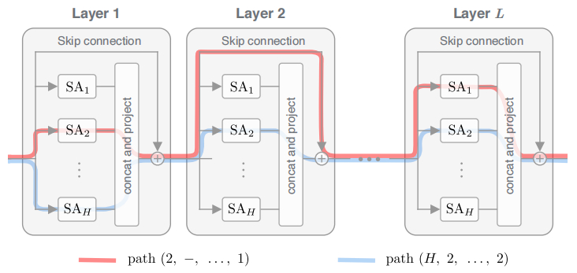
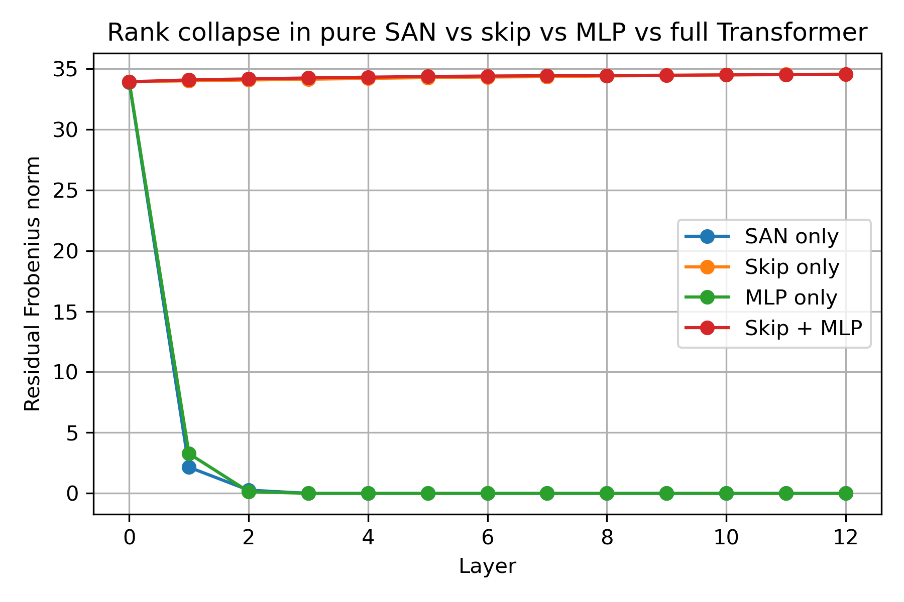

# <center>Deep Dive into Transformer</center>

<center><strong><i>Minrui Huang <br/>July 9, 2025</i></strong></center>

## 1  Architectural Foundations

### 1.1  The Architectural of GPT-2  

​	我们以GPT-2的**模型架构**为切入，分析整个Transformer Block的**结构**及其**内在机制**。GPT-2的架构是在GPT-1的基础上改进的，而GPT-1的模型架构则是拿掉了Multi-Head Cross Attention （多头交叉注意力），只保留了Masked Multi-Head Self-Attention的**Transformer的解码器**。GPT-2的模型架构在GPT-1的基础上做了如下改进：

- Layer normalization被移动到每一个sub-block（两个子层：**解码器自注意力**与**基于位置的前馈神经网络**）的**输入**位置，类似于一个**预激活**的残差网络。同时在**最后的**自注意力块后添加一个额外的layer normalization。
- 采用一种改进的初始化方法，该方法考虑了残差路径与模型深度的累积。在初始化阶段使用缩放因子 $\frac{1}{\sqrt{N}}$ 对residual layer的权重进行缩放操作，其中 $N$ 为residual layer的数量（深度）。
- 字典大小设置为50257；无监督预训练可看到的上下文的 context 由512扩展为1024；Batch Size 大小调整为512。


<center style="color:#C0C0C0">图1 GPT-2的Transformer Block</center>

### 1.2  Transformer Block 构成分析

​	假设我们的输入为一个 $X\in\mathbb{R}^{n\times d}, \quad x_i^{\!\top}\in\mathbb{R}^{1\times d}\;(i=1,\dots,n)$ 的矩阵，其中每一行为一个token的表征向量，长度为$d$（相当于经过了embedding与position encoding操作），接下来它将经过layer normalization、Multi-Head Self-Attention、Position‑wise Feed‑Forward Networks等计算操作，我们一个一个来分析。

#### 1.2.1  Layer Normalization

​	层归一化按**行**（即每个 token）归一化，对同一token的全部特征做**零均值**、**单位方差**处理，公式如下（对于第$i$个token有）：
$$
\mu_i=\frac1d\mathbf1^{\!\top}x_i \in \mathbb{R} , \quad  
\sigma_i\;=\;\bigl(\tfrac1d\|x_i-\mu_i\mathbf1\|_2^2)^{1/2} \in \mathbb{R},\qquad  
\hat x_i=\frac{x_i-\mu_i\mathbf1}{\sigma_i+\varepsilon}\in \mathbb{R}^{d \times 1},
$$
堆叠得到：
$$
\hat{X}=(X-\mu\mathbf{1}_d^\top)\oslash(\sigma\mathbf{1}_d^\top+\varepsilon),
$$
​	其中$\mu\in \mathbb{R}^{n \times 1}$，$\sigma \in \mathbb{R}^{n \times 1}$均为堆叠而成的**向量**；$\oslash$为**Hadamard除**（矩阵逐元素相除）；$\mathbf1_d \in \mathbb{R}^{d \times 1}$为全1列向量；$\varepsilon \in \mathbb{R}^{n \times d}$，用于维持数值稳定。最后加上仿射变换的结果为（$\gamma^\top,\beta^\top$ 向列方向广播）：
$$
\mathrm{LN}(X)=\hat{X}\odot\gamma^\top+\beta^\top,\quad\gamma,\beta\in\mathbb{R}^{d\times 1}.
$$
​	以下为Layer Normalization的优点：**只依赖行内统计**（不需存储/维护全局运行均值与方差；只对最后一维做并行归约），与 batch size 无关，因此测试与训练过程完全一致。同时，LN 能减小层输入**尺度漂移**（internal covariate shift），在注意力与残差结构叠加时，能保持梯度在深f网络中有效传播，加速收敛。
​	Transformer 在**小批量甚至序列长度为 1 的自回归推断**场景中尤为常见，LN**仅涉及当前 token 向量本身**，推断时与训练时的分布完全对齐，无需像 BatchNorm 那样维护滑动均值，也不会出现 batch 幅度微抖动导致的生成质量劣化问题。

​	从几何视角来看，LN的操作是将所有的**token投影到超球面**中：

1. **平移**：$x\mapsto x-\mu_{i}$ —— 消除径向偏移；
2. **径向缩放**：除以 $\sigma$ —— 投影到半径 1 的球面；
3. **各向异性伸缩**：$\odot\gamma$ —— 把球面拉成椭球，提供可学习尺度。

因此 LN 把每个 token 的**向量表示**都 **压到同一“球壳”**（或椭球壳）上；后续注意力仅关心 **方向信息**，点积 $\langle q_i,k_j\rangle$ 规模始终 $\mathcal{O}(1)$，softmax区间稳定。

#### 1.2.2  Multi-Head Self-Attention

​	首先考虑标准的缩放点积注意力机制，对于任一头(head) $h$，可以得到投影矩阵:
$$
Q_{h}=XW_{Q}^{(h)},K_{h}=XW_{K}^{(h)},V_{h}=XW_{V}^{(h)},\quad W_{Q,K,V}^{(h)}\in\mathbb{R}^{d\times d_h},
$$
​	其中 $d_h$ 为**query/key空间**的维度，一般远小于**嵌入空间**的维度 $d$ 。投影矩阵的作用是将**嵌入(Embedding)空间**中的token**映射**到**较小**的**查询、键、值空间**中的某个方向。当键与查询的方向相对齐时，就能认为他们相匹配（高度对齐）。


<center style="color:#C0C0C0">图2 查询向量与键向量的几何关系示意图，其中左图为嵌入空间(Embedding)，右图则为查询/键(query/key)空间</center>

​	未加掩码时的**单头注意力权重**为：
$$
S_h=\frac{Q_hK_h^\top}{\sqrt{h}}\in\mathbb{R}^{n\times n},\quad A_h=\mathrm{softmax}(S_h).
$$
​	$Q_hK_h^\top$ 结果的**每个元素**都可以看作一对**键—查询对**之间的点积，根据点积的概念，可以容易看出**值越大**说明键与查询越**对齐**。同时，为了维持数值稳定性，所有点积的结果都会除以**键—查询空间维度的平方根**。
​	由于 softmax 逐行作用，$A_h$ 的每一行都是一组**概率分布** (行随机矩阵)，每个元素都是一个注意力权重，表示一对**键与查询向量之间的相关度**。

​	GPT的本质还是一个**自回归的语言模型**，在预测阶段，其输出序列的词元是逐个生成的，因此同样需要**掩码**操作（这也是为什么它采用的是解码器，而**BERT**作为**双向**编码器无需掩码操作），即需要保证第 $i$ 个 token 不能看到序列中位置 $j>i$ 的信息，令：
$$
M_{ij}=
\begin{cases}
0, & j\leq i \\
-\infty, & j>i & 
\end{cases}.
$$
​	记该“上三角”$M$矩阵为Masked Attention权重：
$$
A_h=\mathrm{softmax}(S_h+\mathbf{M}).
$$
​	对于行 $i$ 只把允许的列保持原值，其余置 $-\infty$，softmax 后相当于把不合法位置的概率压到 0。

​	在实践中，当给定相同的香询、键和值的集合时，我们希望模型可以基于**相同的注意力机制**学习到**不同的行为**，然后将不同的行为作为知识组合起来，捕获序列内各种范围的依赖关系(例如，短距离依赖和长距离依赖关系)。

​	为此，我们可以用独立学习得到的 $H$ 组不同的**线性投影(MLP**)来变换查询、键和值。然后，这 $H$ 组变换后的査询、键和值将并行地送到**注意力汇聚**中。最后，将这 $H$ 个注意力汇聚的输出**拼接在一起**，并且通过另一个可以学习的线性投影进行变换，以产生最终输出。这种设计即为**多头注意力机制**，对于 $H$ 个注意力汇聚输出，每一个注意力汇聚都被称作一个**头**(head)。


<center style="color:#C0C0C0">图3 多头注意力机制示意图</center>

​	对于每个注意力头 $\mathbf{h}_i(i=1,\dots,H)$：
$$
\mathbf{h}=A_hV_h\in\mathbb{R}^{n\times d_h},
$$
​	经拼接后再投影回 $d$（即嵌入空间）：
$$
MHSA(X)=[\mathbf{h}_1,\dots,\mathbf{h}_H]W_O+b_O, \quad W_O\in \mathbb{R}^{Hd_h\times d}.
$$
​	基于这种设计，每个头都可能会关注输入的不同部分，可以表示比简单加权平均值更复杂的函数。

#### 1.2.3 Position-wise Feed-Forward Network

​	基于位置的前馈网络对**序列中的所有位置的表示进行变换**时，使用的是**同一个多层感知机(MLP)**，这就是称前馈网络是基于位置的原因：
$$
FFN(x)=\sigma(XW_1+b_1)W_2+b_2,
$$
​	其中 $W_1\in\mathbb{R}^{d \times d_{ff}}$，相当于升维的操作； $\sigma$ 为激活函数，如Relu；$W_2\in\mathbb{R}^{d_{ff} \times d }$，相当于降维的操作，回到原通道数；$b_{1,2}$ 为偏置项。

​	这个操作将自注意力产生的**方向特征**转换成**坐标系内的高阶混合特征**，补足网络的非线性表达力。

### 1.3  Transformer的有效性分析

​	从**秩**的视角审视纯注意力网络（Self-Attention Network, SAN），发现：在没有跳跃连接（skip connections）和前馈网络（MLP）的情形下，随着层数加深，其**输出矩阵会以双指数速度退化到秩 1**——即所有 **token 最终“趋于同质”** 。

​	Skip Connection通过**允许信息绕过某些Self-Attention层**，从而在路径分解中引入了大量**短路径** 。最极端的情况是一条长度为0的路径，它直接将原始输入传递到输出，完整保留了输入的秩。这些短路径不会经历Deep Layer导致的严重秩坍塌，因此它们的存在有效地阻止了整个网络输出的退化，这揭示了跳跃连接在Transformer中一个此前未被充分认识的关键作用：**防止秩坍塌**。

​	MLP块作为**非线性变换**，可以增**加其输入矩阵的秩**，与Self-Attention层的降秩进行博弈。MLP的能力可以通过其**Lipschitz** constant来衡量，**Lipschitz常数越大的MLP，其提升秩的能力越强**，从而能更有效地减缓秩坍塌的速度。我们将在后面的篇章对上述理论进行详细证明。

## 2   Spectral Properties of Attention

### 2.1  求解注意力矩阵谱范数的上下界

​	我们先来解释一下什么是谱范数：**谱范数（spectral norm）**是矩阵 $A\in\mathbb{R}^{m\times n}$在 $\ell_2$ 意义下的算子范数——也就是把它看成线性变换 $x\mapsto Ax$ 时对向量欧氏长度的“最大放大倍数”：
$$
\|A\|_2=\max_{x\neq0}\frac{\|Ax\|_2}{\|x\|_2}=\max_{\|x\|_2=1}\|Ax\|_2\tag{1}.
$$
​	如何理解呢？我们可以设想一个这样的场景：


<center style="color:#C0C0C0">图4 谱范数示意图</center>

- 将$A$看作为一个**线性变换**，它将向量 $x$ 拉伸或压缩为 $Ax$；
- 把**单位球**$\|x\|_2=1$看成输入空间的“所有方向”，对其进行线性变换后会得到一个**椭球**（或更高维的超椭球）：$E=\{Ax:\|x\|_2=1\}$；
- “最大”指椭球的最长“半径”，**椭圆最远离原点的那一点**到原点的距离，对应的那条半径的长度就是谱范数；对应的方向叫 **主奇异向量**。

​	在开始证明前，我先强调下**欧几里得 $ℓ₂$ 范数与谱范数的区别**（因为我自己也经常搞混）：

| 名称                        | 记号（常见）                               | **输入对象**                         | 本质含义                                                     |
| :-------------------------- | :----------------------------------------- | :----------------------------------- | :----------------------------------------------------------- |
| **欧几里得范数 / ℓ₂ 范数**  | $\displaystyle\|x\|_2$（有时简写 $\|x\|$） | **向量** $x\in\mathbb R^n$           | 向量的“长度” $\sqrt{\sum_i x_i^2}$                           |
| **谱范数（Spectral norm）** | $\displaystyle\|A\|_2$                     | **矩阵** $A\in\mathbb R^{m\times n}$ | “最坏方向”的放大倍数 $\displaystyle\max_{\|x\|_2=1}\|Ax\|_2$ = **最大奇异值** |

> **关键区别**：ℓ₂ 范数作用在 **向量**，谱范数作用在 **矩阵**；两者的“2”都指用欧几里得距离来度量，但量的是完全不同的对象。

​	现在我们来尝试证明**单头注意力权重矩阵** $A$ 的谱范数 $\|A\|_2$ 的理论上界，已知我们有：
$$
A\in\mathbb{R}^{n\times n},\quad A_{ij}\geq0,\quad \sum_{j=1}^nA_{ij}=1\quad(i=1,\ldots,n).
$$
即 $A$ 为**行随机矩阵**。

​	根据公式$(1)$，为了求$\|A\|_2$，我们可以求$\|x\|_2=1$时$\|Ax\|_2$的值（即单位向量$x$的最大拉伸倍数）：
$$
\|Ax\|_2^2=\sum_{i=1}^n\left(\sum_jA_{ij}x_j\right)^2 \tag{2}.
$$
由 **Jensen不等式：**
$$
\varphi\left(\sum_{i=1}^n\lambda_ix_i\right)\leq\sum_{i=1}^n\lambda_i\varphi(x_i),\quad\lambda_i\geq0,\sum\lambda_i=1,\tag{3}
$$
我们可以得到：
$$
\sum_{i=1}^{n}\left(\sum_{j}A_{ij}x_{j}\right)^{2}\leq\sum_{i,j}A_{ij}x_{j}^{2}=\sum_{j}\left(\sum_{i}A_{ij}\right)x_{j}^{2}.\tag{4}
$$
定义：
$$
c_{\max}:=\max_{1\leq j\leq n}\sum_{i=1}^nA_{ij},
$$
为**最大列和**。故利用 $c_{max}$ 我们最终可以得到以下结论：
$$
\|Ax\|_2^2\leq c_{\max}\sum_jx_j^2=c_{\max}\|x\|_2^2.\tag{5}
$$
因 $\|x\|_2=1$，两边**开平方**可以得到以下结果：
$$
\|A\|_2=\max_{\|x\|_2=1}\|Ax\|_2\leq\sqrt{c_{\max}}\tag{6}.
$$
最坏的情况是**全1都集中在到一列**，在这个情况下$c_{max}=n$，为最大值，故：
$$
\|A\|_2\leq\sqrt{n}\tag{7}.
$$
**上界**得证！

​	接下来我们来简单证明**下界**：

构造单位向量：$u:=\frac{1}{\sqrt{n}}\left[1,1,\ldots,1\right]^\top,\quad\|u\|_2=1$。因 $A$ 的各行和为1，故有：$Au=u$。同时，因为$\|A\|_2$的值**应对应所有单位向量 $x$ 中拉伸程度最大的那一个**（放大倍数最大），故我们可以通过 $u$ 来收缩下界：
$$
\|A\|_2\geq\|Au\|_2=\|u\|_2=1.
$$
因此，行随机矩阵**永远不可能**把所有向量都缩短；最小放大倍数就是1。

​	综合上下界我们可以得到：
$$
1\leq\|A\|_2\leq\sqrt{n},\tag{8}
$$
可以看出，**只有**当$c_{max}=1$，即**同时列随机**时，所有列方向与行方向均平衡，椭球最长半轴 = 1，达到最小可能值，做到不对向量进行“放大”：$\|A\|=1$。

​	也就是说，在多数情况下，$\|A\|\geq1$，是expansive（趋向扩散）的。然而，对于Transformer这样的深度学习模型来说，其往往会有很多很深的层，在**前向传播**的过程中，若反复乘以谱范数大于1的注意力权重矩阵，特征向量会被**反复放大**，可能导致**后续层饱和**或**数值发散、溢出**，并把**梯度放大到爆炸**，对误差、噪音也会同样放大。除此之外，模型的 **Lipschitz 常数**等于各层**谱范数乘积的上界**；若任何一层 > 1，总 Lipschitz 增大，输入的微小扰动会被放大，造成**鲁棒性下降**。我们会在第三章再去做详细论证。

### 2.2  Layer Normalization 对谱范数上界的约束

​	那么，我们就知道了 $A$ 发散/扩散时，会对模型产生诸多不利影响，而根据我们推导的公式$(8)$，我们所能做的就是压缩谱范数的上界，从而令 $A$ 趋向于 **non-expansive**。针对这个问题，GPT-2做出了相应的改进，即将LN移动到每一个sub-block的输入位置，也就是 **Pre-Norm**：
$$
H_{\ell+1}=H_\ell+\mathrm{SubLayer}\left(\mathrm{LN}(H_\ell)\right).
$$
 对第 $i$ 个 token 对应的嵌入向量 $h\in \mathbb{R}^d$ 进行**层归一化**操作：
$$
z=\mathrm{LN}(h)=\gamma\odot\frac{h-\mu\mathbf{1}}{\sigma}+\beta,\quad\mu=\frac{1}{d}\mathbf{1}^\top h
$$
由$\sigma=\sqrt{\frac{1}{d}\|h-\mu\mathbf1\|^2_2}$ 可得：
$$
\begin{Vmatrix}
h-\mu\mathbf{1}
\end{Vmatrix}_2=\sqrt{d}\sigma \tag{9}
$$
​	由于LayerNorm输出**(去掉平移项β)**是逐坐标缩放：$z=\gamma\odot x=(\gamma_1x_1,\gamma_2x_2,\ldots,\gamma_dx_d)^\top$，我们可以将乘以$\gamma$看成“**对角矩阵**作用“：$\gamma\odot x=D_\gamma x,\quad D_\gamma:=\mathrm{diag}(\gamma_1,\ldots,\gamma_d)$。利用**谱范数不等式**（诱导性），对于任意矩阵–向量乘积都有：$\|D_\gamma x\|_2\leq\|D_\gamma\|_2\|x\|_2$。而对角矩阵的奇异值就是各对角绝对值，则**最大奇异值**即为：$\|\gamma\|_{\infin}$，而$\|\gamma\|_\infty=\max_{1\leq i\leq d}|\gamma_i|$，即取**向量**所有分量的绝对值，看其中 **最大的那一个**。由此我们可以得到：
$$
\|D_\gamma\|_2=\|\gamma\|_\infty\tag{10}
$$
结合$(9),(10)$我们可以推导出：
$$
\|z\|_2=\left\|\gamma\odot\frac{h-\mu\mathbf{1}}{\sigma}\right\|_2=\left\|D_{\gamma}\frac{h-\mu\mathbf{1}}{\sigma}\right\|_2\leq\|\gamma\|_\infty\frac{\|h-\mu\mathbf{1}\|_2}{\sigma}=\|\gamma\|_{\infin}\sqrt{d}.
$$
令 $\Gamma:=\|\gamma\|_{\infty}$，即得：
$$
\|z\|_2\leq \Gamma\sqrt{d}.\tag{11}
$$
令$\sigma_Q:=\|W_Q\|_2,\quad\sigma_K:=\|W_K\|_2$，我们可以得到对应第 $i$ 个token 的 query 和 key 向量的范数：
$$
\|q_i\|_2=\|z_iW_Q\|_2\leq\|z_i\|_2\cdot\|W_Q\|_2\leq\Gamma\sigma_Q\sqrt{d},\tag{12}\\
$$

$$
\|k_j\|_2=\|z_jW_K\|_2\leq\|z_j\|_2\cdot\|W_K\|_2\leq\Gamma\sigma_K\sqrt{d}.\tag{13}
$$

上述推导依然使用了**谱范数不等式**：$\|Ax\|_2\leq\|A\|_2\|x\|_2$。

​	基于$|\langle a,b \rangle|\leq\|a\|_2\|b\|_2$ 以及公式 $(11),(12),(13)$，对于**单头注意力** logits：
$$
|\ell_{ij}|:=\frac{|\langle q_i,k_j\rangle|}{\sqrt{d}}\leq\frac{\|q_i\|_2\|k_j\|_2}{\sqrt{d}}\leq\Gamma^2\sigma_Q\sigma_K\sqrt{d}=:M.
$$
即得：$-M\leq l_{i,j}\leq M$。i故对于某一 token $i$ ，其与其他 token 的注意力 logits 的**最大差值**为（即注意力矩阵中同一行的任意两列的最大差值）：
$$
\Delta=\max_j\ell_{ij}-\min_{j\prime} \ell_{ij\prime}\leq2M.
$$
已知 softmax 运算：
$$
A_{ij}=\frac{e^{\ell_{ij}}}{\sum_{t=1}^ne^{\ell_{it}}}.
$$
令该行的最大值为$\ell_{\mathrm{max}}$，则对注意力矩阵的任意元素$A_{(i,j)}$有：
$$
A_{ij}\leq\frac{e^{\ell_{\max}}}{e^{\ell_{\max}}+(n-1)e^{\ell_{\max}-\Delta}}=\frac{1}{1+(n-1)e^{-\Delta}}\leq\frac{1}{1+(n-1)e^{-2M}}=:\alpha
$$
于是任意列和：
$$
\sum_{i=1}^nA_{ij}\leq n\alpha=:c_{\max}.\tag{14}
$$
将$(14)$代入$(6)$：$\|A\|_2\leq\sqrt{c_{\max}}$ 得最终结果：
$$
\|A\|_2\leq\sqrt{\frac{n}{1+(n-1)e^{-2\Gamma^2\sigma_Q\sigma_K\sqrt d}}}
$$
**结论**：

-  在 **Post-Norm** 或缺乏足够归一化的体系里，随着**模型深度**增大，注意力矩阵的**范数上界**可能一路抬高到理论极限 $\sqrt n$，并把梯度放大到爆炸；
- **Pre-Norm** 相当于每层先重置尺度，使得 $Q,K$ 的范数被固定常数控制，有效阻止这种随层数失控的增长。$\Gamma,\sigma_Q,\sigma_K$ 由初始化和正则控制，不随深度指数增长，是与层数无关的常数。于是 softmax logits 的跨度 $\Delta$ 有一个与层深无关的上界，进而把注意力矩阵 $A$ 的最大列和 $c_{\max}$ 压到离 1 很近的范围。没有这种归一化，$\|A\|_2$ 可能随深度朝 $\sqrt n$ 飙升并引发梯度爆炸。

| 结论                   | 说明                                                         |
| ---------------------- | ------------------------------------------------------------ |
| **更紧的谱范数上界**   | Pre-Norm把 $\|A\|_2$ 的理论上界从“可能是 $\sqrt n$”压至**深度无关的常数** $\sqrt{c_{\max}(M)}。$ |
| **梯度不易爆炸/消失**  | 反向链中的 $A^\top$ 同样几乎 non-expansive；跨层乘积不会指数放大或衰减。 |
| **训练深度可大幅增加** | 这正是 GPT-2 以后 Transformer 模型普遍采用 Pre-Norm 的经验原因之一。 |

### 2.3  实验检验

​	我们使用 PyTorch 和 huggingface Transformers 做了一个微型实验：加载 GPT-2 以及 GPT-1 大模型（**作为Pre-norm 与 Post-norm的对照**），把一句包含若干 token 的英文句子编码后前向推理，并拿到每层自注意力权重矩阵。随后，对每个头的注意力矩阵求最大奇异值（即谱范数，衡量线性映射的放大倍数），再在该层所有头之间取平均，得到每层“平均谱范数”列表。最后用 matplotlib 把这些值随层号的变化画成折线图，直观展示 GPT-2 及 GPT-1 各层注意力的线性放大趋势。具体代码如下：

```python
# Denis
# -*- coding: utf-8 -*-
import torch
import matplotlib.pyplot as plt
from typing import List
from transformers import AutoTokenizer, AutoModel
import pandas as pd

def load_token_sequences(csv_path: str) -> List[str]:
    df = pd.read_csv(csv_path, usecols=["token_sequence"])
    return list(df["token_sequence"].astype(str))

MODELS = {
    "gpt2"       : "gpt2",
    "openai-gpt" : "openai-gpt",
}
TEXTS  = load_token_sequences("Short_English_Sentences.csv")
print(TEXTS)
DEVICE = "cuda:1" if torch.cuda.is_available() else "cpu"

def layer_sigma_means(model_name: str, texts: List[str]):
    tok = AutoTokenizer.from_pretrained(model_name, local_files_only=True)
    if tok.pad_token is None:
        tok.add_special_tokens({'pad_token': '[PAD]'})
    ids = tok(
        texts,
        return_tensors="pt",
        padding=True,
        truncation=True
    ).to(DEVICE)

    model = AutoModel.from_pretrained(
        model_name, output_attentions=True, local_files_only=True
    )
    if tok.pad_token_id >= model.config.vocab_size:
        model.resize_token_embeddings(len(tok))
    model.config.pad_token_id = tok.pad_token_id
    model = model.to(DEVICE).eval()

    curve = []
    with torch.no_grad():
        attns = model(**ids).attentions  # tuple[num_layers]
        for lay_attn in attns:           # lay_attn.shape = (B, H, S, S)
            sigmas = [
                torch.linalg.svdvals(head.float()).max()
                for sample in lay_attn   # 遍历 batch
                for head in sample       # 遍历每个 head
            ]
            curve.append(torch.stack(sigmas).mean().item())

    del model
    if torch.cuda.is_available():
        torch.cuda.empty_cache()
    return curve

curves = {name: layer_sigma_means(path, TEXTS) for name, path in MODELS.items()}

plt.figure(figsize=(6, 4))
for name, y in curves.items():
    plt.plot(range(1, len(y) + 1), y, marker="o", label=name)
plt.xlabel("Layer")
plt.ylabel("Spectral norm (avg across samples & heads)")
plt.title("GPT-1 (Post-LN) vs GPT-2 (Pre-LN) attention spectral norms")
plt.grid(True)
plt.legend()
plt.tight_layout()
plt.savefig("spectrum.png", dpi=300)
print("Plot saved as 'spectrum.png'.")

```

​	我先使用了128个**较短的 token 序列**（每句话由1~5个 token 组成）作为输入，得到的结果如下图所示：


<center style="color:#C0C0C0">图5 较短token下GPT-1与GPT-2的谱范数对照图</center>

其中横坐标为模型的层数，纵坐标为**该层所有头的注意力矩阵谱范数的平均值**。从图中可以看到，Post-Norm 结构的 openai-gpt (GPT-1) （橙线）在第二层就迅速升到大约 2.05，随后虽有轻微回落，但在第 8 层以后再次抬头并最终停在 2.25 左右；而 Pre-Norm 的 GPT-2 （蓝线）从 1.5 左右缓慢爬升，始终保持比 Post-LN 低 0.1–0.25 的间隔，并在末层回落到约 1.9。

​	接下来，我用128个**较长的 token 序列**（由12~18个 token 组成）作为输入，得到的结果如下图所示：


<center style="color:#C0C0C0">图6 较长token下GPT-1与GPT-2的谱范数对照图</center>

整体趋势是差不多的，只是由于 token 数量 $n$ 的显著增大，注意力权重矩阵的谱范数整体不可避免地同步增大，但依然可以明显看出 Pre-Norm 的优势。

​	为了进一步探讨 Pre-Norm 在深层网络中优化的机制，我同时也在**36层的 GPT2-large **上进行了相同的实验，结果如下：


<center style="color:#C0C0C0">图7 不同深度的GPT-2的谱范数对照图</center>

​	在 36 层 GPT-2-large 上复现相同实验后可以看到，谱范数曲线在前 10 层依旧快速抬升，到中段（第 12 层左右）便趋于平台，随后在 20 至 32 层之间稳定徘徊在 2.0~2.1 的区间，最后两三层出现明显回落，最低点接近 1.5。与 12 层的 GPT-2 相比，这条曲线几乎就是将浅层模型的走势在纵轴上做了一次“等比放大”并沿层数方向拉长：起始段斜率相似，平台值略高，但下降端点仍落回到同一数量级。

​	Pre-Norm 在深层堆叠时能够把每层注意力的最大放大倍数牢牢限制在一个窄幅常数区间内，使得谱范数不会随深度累积而失控；而 Post-Norm 缺乏这种钳制，当层数增加到十几层时就已显著高于 Pre-Norm。这正解释了现代大型 Transformer 一般都采用 Pre-Norm：它能在保证表达能力的同时，把每层注意力的 Lipschitz 系数保持在一个常数范围内，从而避免梯度随深度指数式爆炸，令**更深的堆叠**成为可能。

## 3  Transformer收敛性分析

​	正如我在第一部分所述，**跳跃连接（skip connections）**和**多层感知机（MLP）**在Transformer中扮演者关键的角色。对于缺少了这两个结构的纯注意力网络（Self-Attention Network, SAN），**随着网络深度增加，其输出会以双指数**速率**收敛**到**秩1**的 “token 统一” 矩阵，造成**信息坍塌（information collapse）**，而引入跳跃连接和 MLP 则能有效防止输出退化。

​	论文*《Attention is not all you need: pure attention loses rank doubly exponentially with depth》*通过理论分析与详细的实验，验证了在标准Transformer架构中存在的这种**收敛**现象。

### 3.1  路径分解定理

​	文章将多头自注意力网络的输出表达为**多个单头网络之和**。这些单头网络被称为**"路径"**，每条路径由一系列注意力头表示。

​	令$X \in \mathbb{R}^{n\times\ d_{in}}$ 为包含 $n$ 个 token 的输入矩阵。SAN 由 $L$ 个多头自注意力层构成，每层包含$H$个注意力头。第 $h$ 个自注意力头的输出可表示为：
$$
\mathrm{SA}_h(X)=P_hXW_{V,h}+1b_{V,h}^\top.
$$
其中，$W_{V,h}\in \mathbb{R}^{d_{in}\times d_v}$ 为值（value）矩阵，$P_h\in\mathbb{R}^{n\times n}$ 为行随机矩阵（即前文的注意力矩阵）：
$$
\begin{aligned}
P_{h}&=\mathrm{softmax}\left(d_{qk}^{-\frac{1}{2}}(\boldsymbol{XW}_{Q,h}+\boldsymbol{1b}_{Q,h}^{\top})(\boldsymbol{XW}_{K,h}+\boldsymbol{1b}_{K,h}^{\top})^{\top}\right) \\
&=\mathrm{softmax}(d_{qk}^{-\frac{1}{2}}(\boldsymbol{XW}_{QK,h}\boldsymbol{X}^{\top}+\boldsymbol{1b}_{Q,h}^{\top}\boldsymbol{W}_{K,h}^{\top}\boldsymbol{X}^{\top})),
\end{aligned}
$$
其中 $W_{K,h},W_{Q,h}\in\mathbb{R}^{d_{in}\times d_{qk}}$ 分别为 key 与 query 的投影矩阵，$W_{QK,h}=W_{Q,h}W_{K,h}^{\top}$，最后使用softmax函数对其输入的每一行进行独立运算得到最终结果。

​	每个SAN层的输出通过将所有 $H$ 个注意力头的独立输出（沿最后一个维度）进行拼接，并通过线性投影将其映射到适当大小的子空间而形成：
$$
\begin{aligned}
\mathrm{SA}(\boldsymbol{X}) & =\mathbf{1}[\boldsymbol{b}_{O,1}^{\top},\cdots,\boldsymbol{b}_{O,H}^{\top}]+[\mathrm{SA}_{1}(\boldsymbol{X}),\cdots,\mathrm{SA}_{H}(\boldsymbol{X})][\boldsymbol{W}_{O,1}^{\top},\cdots,\boldsymbol{W}_{O,H}^{\top}]^{\top} \\
 & =\sum_{h\in[H]}P_{h}XW_{h}+\mathbf{1}b_{O}^{\top},
\end{aligned}
$$
其中 $W_{h}=W_{V,h}W_{O,h}^{\top},\quad b_{O}=\sum_{h}b_{O,h}。$

​	假设 $X^l$ 为第 $l$ 层的输出，并规定 $X^0=X$。按照常规做法，我们让所有层都由相同数量的注意力头组成。忽略偏置项 $\mathbf{1}b_{O,h}^\top$ ，SAN 的输出为：
$$
\begin{aligned}
X^{L} & =\sum_{h\in[H]}P_{h}^{L}X^{L-1}W_{h}^{L} \\
 & =\sum_{h\in[H]}P_{h}^{L}\left(\sum_{h^{\prime}\in[H]}P_{h^{\prime}}^{L-1}X^{L-2}W_{h^{\prime}}^{L-1}\right)W_{h}^{L}=\sum_{h_{L},h_{L-1}\in[H]}P_{h_{L}}^{L}P_{h_{L-1}}^{L-1}X^{L-2}W_{h_{L-1}}^{L-1}W_{h_{L}}^{L},
\end{aligned}
$$
经过递推展开的结果为：
$$
X^{L}=\sum_{h_{1},\ldots,h_{L}\in[H]}(P_{h_{L}}^{L}\cdots P_{h_{1}}^{1})\boldsymbol{X}({W}_{h_{1}}^{1}\cdots{W}_{h_{L}}^{L}).
$$

若将自注意力网络视作有向无环图，根据上述公式，我们可以把**每一层的每一个注意力头**看作一个节点，且只允许**从层 $l$ **的**任一头**连到**层 $l+1$ **的**任一头**，这天然形成了一个**$L$层、无回路的有向图**。



<center style="color:#C0C0C0">图7 深度自注意力网络（SAN）中两条路径，具有H个头和L层。在每一层，路径可以选择经过其中一个头或绕过该层。在每个注意力层后添加一个多层感知器（MLP）模块即构成Transformer架构。</center>

故对于深度为 $L$、每层含 $H$ 个注意力头的自注意力网络输出（包含偏置和跳跃连接）由以下公式给出：
$$
SAN(X)=\sum_{path\in[H]}P_{path}\boldsymbol{X}W_{path}+\mathbf{1}b^\top,
$$
其中 $P_{path}=P_{h_{L}}^{L}\cdots P_{h_{1}}^{1}$ 是一个依赖输入的随机矩阵，$W_{path}=W_{h_{1}}^{1}\cdots W_{h_{L}}^{L}$与 $b$ 则与输出 $X$ 无关。同时，公式的每一项都描述了跨越不同层的注意力头的长度为 $L$ 的路径：
$$
path=(h_1,\ldots,h_L),\quad h_l\in(0,1,\ldots,H).
$$
这条路径依次指定第 1 层用哪一头、第 2 层用哪一头，直到第 $L$ 层，且**没有 skip-connection** 时，每层必须选头，因而共有 $H^L$ 条路径。因此，**路径分解将 SAN 的作用描述为多个简单单头网络的组合**。为理解路径间的相互依存关系，可将执行的操作分为两类：

- 左侧乘法，在 token 维度做加权平均，**跨 token 交互**；
- 右侧乘法，对每个 token 的通道向量做线性变换，**token-wise 独立**。

### 3.2  单头 SAN 的收敛性

​	在考虑整个 SAN 的收敛性前，文章先独立分析了每一条路径的行为，首先是前向传播过程中残差的变化：
$$
\mathrm{res}(X)=X-1x^\top,\quad x=\mathrm{argmin}_x\|X-1x^\top\|=\frac{1}{n}1^\top X.
$$
这里的残差并不是指ResNet里的那种“残差连接”，他的意思是将矩阵 $X$ 投影到与“常数矩阵”**正交**的子空间上——也就是把**均值部分**去掉，只留下“不同 token 之间的差异”。本质就是**统计学里的“去均值”**：就像分析数据时先把每个样本减掉全体平均，这样可以看到真正的“样本间差异”而不受整体偏移影响。

根据以下定理，残差范数会以惊人的速度（以立方速率双指数级）收敛至零（证明略）：

对任意由 $L$ 层纯单头自注意力（SAN）堆叠而成的网络，假设每层权重满足：
$$
\|W_Q^\ell\|_1\|W_K^\ell\|_1\|W_V^\ell\|_{1,\infty}\leq\beta,
$$
其中 **$\|A\|_{1,\infty}=\sqrt{\|A\|_1\|A\|_\infty}$** ，其便于同时约束**行和列尺度**，控制 softmax 里“列尺度失衡”导致的极端注意力分配，同时保证行随机矩阵乘积仍然收敛：

| 矩阵范数   | 公式                                                         | 直观含义                                         |
| ---------- | ------------------------------------------------------------ | ------------------------------------------------ |
| **1-范数** | $\displaystyle\boxed{\;\lVert A\rVert_{1} \;=\; \max_{1\le j\le n}\;\sum_{i=1}^{m}\lvert a_{ij}\rvert\;}$ | 把 **每一列** 的绝对值相加，再取其中*最大列和*。 |
| **∞-范数** | $\displaystyle\boxed{\;\lVert A\rVert_{\infty} \;=\; \max_{1\le i\le m}\;\sum_{j=1}^{n}\lvert a_{ij}\rvert\;}$ | 把 **每一行** 的绝对值相加，再取其中*最大行和*。 |

并令 $\gamma$ 表示与注意力 logits 相关的常数（衡量 softmax 误差），则输出的残差满足：
$$
\|res(SAN(\boldsymbol{X}))\|_{1,\infty}\leq\left(\frac{4\gamma\beta}{\sqrt{d_{qk}}}\right)^{\frac{3^{L}-1}{2}}\|res(\boldsymbol{X})\|_{1,\infty}^{3^{L}},\tag{1}
$$
这相当于向秩为1的矩阵进行双重指数收敛：

- 左侧 $\|\operatorname{res}(\mathrm{SAN}(X))\|$ 是网络输出去掉“常数方向”后的部分。
- 右侧包含两部分因子：
  1. $\bigl(\tfrac{4\gamma\beta}{\sqrt{d_{qk}}}\bigr)^{\tfrac{3L-1}{2}}$：随着深度 $L$ 指数增长的常数前因子；
  2. $\|\operatorname{res}(X)\|^{3^L}$：残差范数被“立方再立方…（共 $L$ 次）”的幂塔摧毁。只要初始残差 $\|\operatorname{res}(X_0)\|<1$，输出残差几乎瞬间跌到 0，**比普通行随机矩阵乘积的线性收敛要快得多**。

​	要使上述公式右侧能保证收敛（即最终输出真的趋近 rank-1）需要：
$$
\frac{4\gamma\beta}{\sqrt{d_{qk}}}\;<\;1
  \quad\Longleftrightarrow\quad
  4\gamma\beta \;<\;\sqrt{d_{qk}}.
$$
其中$\beta$ 控制权重大小，$\gamma$ 控制 logits 误差，$\sqrt{d_{qk}}$ 是 softmax 的缩放，“分母越大”越能抑制注意力误差。

### 3.3  对于完整 SAN 的指数级收敛

​	现在继续分析每层具有多个头的 SAN 的收敛性。具体结论如下（证明略）：

​	对一个 **深度为 $L$、宽度为 $H$**（即每层 $H$ 个头）、且 **无残差跳接** 的纯自注意力网络，若对所有层 $l$ 和头 $h$ 都有：
$$
\bigl\|W^{\ell}_{QK,h}\bigr\|_1\;\bigl\|W^{\ell}_{V,h}\bigr\|_{1,\infty}\le\beta,
$$
令 $\gamma$ 表示与注意力 logits 相关的误差项，则其输出残差满足：
$$
 \bigl\|\mathrm{res}\bigl(\mathrm{SAN}(X)\bigr)\bigr\|_{1,\infty}
 \;\le\;
 \Bigl(\tfrac{4\,\gamma\,\beta\,H}{\sqrt{d_{qk}}}\Bigr)^{\frac{3L-1}{2}}
 \;\bigl\|\mathrm{res}(X)\bigr\|_{1,\infty}^{\,3^L}.
$$
与$(1)$相比，公式多出了一个常数 $H$，源自每层有 $H$ 条并行路径，将原来的 $\tfrac{4\gamma\beta}{\sqrt{d_{qk}}}$ 放大为 $\tfrac{4\gamma\beta\,H}{\sqrt{d_{qk}}}$。类似的，只要满足：
$$
4\,\gamma\,\beta\,H\;<\;\sqrt{d_{qk}},
$$
  输出残差就 **以双指数速率** 收敛到 0，网络输出矩阵退化为 rank-1。

### 3.4  对抗秩崩坏的策略

​	那么当注意力机制退化为**随深度呈双重指数增长的秩1矩阵**时，基于注意力的网络为何仍能保持实际应用效果？文章聚焦于transformer架构，通过整合该架构特有的结构（如：跳跃连接、MLP）来拓展分析维度。文章采用系统化的方法，逐步对 SAN 架构进行改进，针对每种情况，重新推导收敛边界：

#### 3.4.1  跳跃连接（Skip connections）

​	原本不考虑跳跃连接时，每层必有头 $h\in[H]$，路径都是长为 $L$ 的序列 $(h_1,\dots,h_L)$。有了跳跃连接（skip connection）后，我们用 $h_l=0$ 来表示“在第 $\ell$ 层跳过该层”（即直接把输入传到下一层，不经过任何注意力头或权重）。同时规定：
$$
P^{}_{0}=I,\quad W^{}_{0}=I,
$$
也就是当跳过时，既不做行随机平均，也不做通道变换。这样原输出可以写作：
$$
X^L \;=\;\sum_{h_1,\dots,h_L\in\{0,1,\dots,H\}}
\bigl(P^L_{h_L}\cdots P^1_{h_1}\bigr)\;X\;\bigl(W^1_{h_1}\cdots W^L_{h_L}\bigr).
$$
​	 设 $\mathcal P_\ell$ 是“恰好走了 $\ell$ 层注意力”的路径集合，则：
$$
|\mathcal P_\ell|\;=\;\binom{L}{\ell}\;H^\ell.
$$
且$\sum_{\ell=0}^L\binom{L}{\ell}H^\ell=(1+H)^L$，比原先的 $H^L$ 大得多。跳跃连接让网络除了“全走注意力”的长路径，还保留了大量“少走注意力”的短路径，极大地丰富了网络的信息通道。

​	因为带有跳跃连接的 SAN 不会出现秩坍缩现象，我们可以通过证明其下界来反映其实际意义：

利用路径分解，总能找到一条“跳过所有层”的路径——即长度为 0 的路径，它保留了最初的残差 $\mathrm{res}(X)$。因此，对于任何参数化方式，只要它使得 SAN 各层的输出与输入正交，都必然满足
$$
\bigl\|\mathrm{res}(X^L)\bigr\|\;\ge\;\bigl\|\mathrm{res}(X)\bigr\|.
$$

一个最简单的例子是，对所有层 $l=1,\dots,L$ 都令 $W_V^l=0$，此时自注意力层没有任何非平凡贡献，残差完全保持不变，即

$$
\bigl\|\mathrm{res}(X^L)\bigr\|\;=\;\bigl\|\mathrm{res}(X)\bigr\|.
$$

> **故对任意深度 $L$、宽度 $H$ 且带 skip connections 的 SAN，都存在“无限多”参数配置，使得**
> $$
> \|\mathrm{res}(X^L)\|\;\ge\;\|\mathrm{res}(X)\|.
> $$
> **即使 $L\to\infty$，只要你选择这些特殊配置，输出残差也不会减小。**

#### 3.4.2  **Multi-layer perceptions (MLP)**

​	文章接下来研究使用多层感知机（MLP）会如何影响残差，将每一层拓展为先做多头注意力再过一个小型的 MLP（加上偏置）：
$$
X^{\ell+1}
=f_\ell\Bigl(\underbrace{\sum_{h=1}^H P_h\,X^\ell\,W_h}_{\text{多头注意力}}\Bigr).
$$
这里 $f_\ell$ 同时承担了 **MLP** 本身（通常是两层线性+非线性激活）和输出的偏置项。$f_\ell$ 因为由有界线性变换和有界激活构成，所以对矩阵范数 $\|\cdot\|_{1,\infty}$ **是 Lipschitz 连续** 的。

​	定义 $\lambda_{\ell,1,\infty}$ 为第 $\ell$ 层 MLP $f_\ell$ 在 $\|\cdot\|_{1,\infty}$ 下的 **Lipschitz 常数**：
$$
\|f_\ell(Z_1)-f_\ell(Z_2)\|_{1,\infty}
  \;\le\;\lambda_{\ell,1,\infty}\,\|Z_1-Z_2\|_{1,\infty}.
$$
为了简化，假设所有层的 Lipschitz 常数都不超过同一个上界 $\lambda$：$\lambda_{\ell,1,\infty}\le\lambda$ 对所有 $\ell$ 成立。

​	考虑一个深度为 $L$、每层具有 $H$ 个头且在每层后都接入一个 MLP 的自注意力网络。假设对所有头 $h\in[H]$ 和层 $ \ell\in[L]$，都有：
$$
\bigl\|W^{{\ell}}_{QK,h}\bigr\|_1\;\bigl\|W^{{\ell}}_{V,h}\bigr\|_{1,\infty}\;\le\;\beta,
$$
令 $\gamma$ 为与注意力条目相关的常数项，则网络在第 $L$ 层输出的残差（去掉常数方向后的部分）满足：
$$
\bigl\|\mathrm{res}(X^L)\bigr\|_{1,\infty}
\;\le\;
\Bigl(\frac{4\,\gamma\,\beta\,H\,\lambda}{\sqrt{d_{qk}}}\Bigr)^{\frac{3^{L}-1}{2}}
\;\bigl\|\mathrm{res}(X)\bigr\|_{1,\infty}^{\,3^{L}}.
$$
这意味着，只要：$\displaystyle4\,\gamma\,\beta\,H\,\lambda < \sqrt{d_{qk}}$，残差就会以**双指数**速率衰减到 0。

如上所见，**尽管 MLP 的作用不及跳跃连接那样彻底**，但MLP 的 Lipschitz 常数 $\lambda$ **直接控制了收敛速度**——MLP 越“强”（$\lambda$ 越大），残差衰减得就越慢。这揭示了自注意力层与 MLP 之间的“拉锯战”：注意力层在不断抹平差异，而 MLP 通过非线性有助于**增加秩**，两者相互抗衡。

​	值得一提的是，使用 MLP 来对抗秩塌陷并非没有代价。虽然**增大 Lipschitz 常数能减慢残差收敛**，但同时也会降低模型的鲁棒性、提高对输入扰动的敏感度，并可能因梯度方差增大而使优化更加困难。

### 3.5  实验验证

​	简单编写了以下脚本，对比四种变体（纯自注意力、仅跳跃连接、仅 MLP、跳跃+MLP）在深度堆叠时残差（去均值后 Frobenius 范数）随层数的变化：

```python
import torch
import torch.nn.functional as F
from torch import nn
import matplotlib.pyplot as plt

torch.manual_seed(0)
n_tokens   = 10
d_model    = 128
depth      = 12
n_heads    = 1
batch_size = 32

def residual_fro_norm(X: torch.Tensor) -> torch.Tensor:
    """
    X: (B, T, D)
    返回 size-B 的向量，每个元素是该 sample
    去除 token 维度行均值后的 Frobenius 范数
    """
    mu = X.mean(dim=1, keepdim=True)
    R  = X - mu
    return R.flatten(1).norm(p='fro', dim=1)

class TransformerBlock(nn.Module):
    """
    Pre-Norm Transformer block = LayerNorm → MHA → (optional) MLP → Skip
    """
    def __init__(self, d_model: int, n_heads: int, use_mlp: bool, use_skip: bool):
        super().__init__()
        self.ln1 = nn.LayerNorm(d_model)
        self.self_attn = nn.MultiheadAttention(
            embed_dim=d_model,
            num_heads=n_heads,
            batch_first=True,
            bias=False,
            add_bias_kv=False,
            add_zero_attn=False,
        )
        self.use_mlp = use_mlp
        self.use_skip = use_skip
        if use_mlp:
            self.ln2 = nn.LayerNorm(d_model)
            self.fc1 = nn.Linear(d_model, d_model)
            self.fc2 = nn.Linear(d_model, d_model)

    def forward(self, X: torch.Tensor) -> torch.Tensor:
        Z = self.ln1(X)
        attn_out, _ = self.self_attn(Z, Z, Z)
        Y = attn_out
        if self.use_mlp:
            U = self.ln2(Y)
            Y = self.fc2(F.relu(self.fc1(U)))
        if self.use_skip:
            Y = Y + X
        return Y

def run_experiment(use_skip: bool, use_mlp: bool):
    blocks = nn.ModuleList([
        TransformerBlock(d_model, n_heads, use_mlp, use_skip)
        for _ in range(depth)
    ])
    X = torch.randn(batch_size, n_tokens, d_model)
    norms = []
    norms.append(residual_fro_norm(X))
    for blk in blocks:
        X = blk(X)
        norms.append(residual_fro_norm(X))
    return torch.stack(norms, dim=0)

if __name__ == "__main__":
    variants = {
        'SAN only':    (False, False),
        'Skip only':   (True,  False),
        'MLP only':    (False, True),
        'Skip + MLP':  (True,  True),
    }

    all_norms = {}
    for name, (skip, mlp) in variants.items():
        vals = run_experiment(skip, mlp)
        all_norms[name] = vals.mean(dim=1)

    plt.figure(figsize=(6,4))
    for label, curve in all_norms.items():
        plt.plot(curve.detach().numpy(), marker='o', label=label)
    plt.xlabel("Layer")
    plt.ylabel("Residual Frobenius norm")
    plt.title("Rank collapse in pure SAN vs skip vs MLP vs full Transformer")
    plt.legend()
    plt.grid(True)
    plt.tight_layout()
    plt.savefig("collapse_optimized.png", dpi=300)
    plt.show()
```



<center style="color:#C0C0C0">图8 四种变体在深度堆叠时残差随层数的变化（其中橙色的Skip Only被红色的Skip+MLP覆盖了）</center>

​	在**纯自注意力网络（SAN only）** 中，如理论所说，残差范数在第一层便急剧下降——从初始的约 34 快速滑落至接近 0，并在后续全部层几乎保持为 0。这充分验证了去除跳跃连接与 MLP 后，纯注意力机制在深度堆叠时会以双指数速率抹平 token 之间的差异，最终输出退化为近乎 rank-1 矩阵。

​	对比之下，仅加入**跳跃连接（Skip only）** 能够将残差稳稳地“传导”到每一层：残差范数从初始的 34 左右略微震荡，但始终保持在同一水平线上，不发生衰减。这个现象直观地说明，空路径（length-0 path）构成的恒等映射切实阻止了注意力层对残差的压平作用，理论中的下界被逐层保留。

​	在 **仅使用 MLP（MLP only）** 的设置下，残差的衰减速度相较纯 SAN 略有放缓：第一层后仍然出现明显下降，但之后在两三层内便降至接近 0。MLP 的非线性和增秩能力在一定程度上减缓了注意力带来的 rank collapse，但由于缺乏持续的跳跃通道，它依然无法根本阻止双指数级的残差消亡。

​	最后，**完整 Transformer Block（Skip + MLP）** 同时拥有跳跃连接和 MLP，在实验证明中表现最佳：残差范数不仅不衰减，反而随着层数微微上升，稳定维持在原始水平之上。这里 MLP 对残差的“注入”与跳跃连接的“保留”协同作用，使得网络既能保持深层特征的多样性，又避免了纯注意力的塌陷，完美契合我们在理论中关于“跳跃连接提供下界，MLP提升秩”的推导。

## 4  结语

​	在深入探讨Transformer架构的旅程中，我们见证了其精妙设计的核心机制——从GPT-2的预激活残差结构与层归一化的位置优化，到多头注意力对长程依赖的捕捉能力，再到跳跃连接与MLP模块协同对抗深度网络中的秩坍塌现象。

​	这些创新不仅通过严格的谱范数分析揭示了模型稳定性的数学保障（如 $\|A\|_2 \leq \sqrt{c_{\max}}$ 的约束），更通过路径分解定理阐明了组件间的动态平衡：注意力层倾向于抹平特征差异，而跳跃连接保留原始信息通路，MLP则通过非线性变换注入秩提升动力。

​	实验数据进一步验证了理论，无论是注意力谱范数的层间可控性，还是残差范数在完整Transformer中的持久性，均彰显了这一架构对深层堆叠的适应性。最终，Transformer通过**多组件的正交互补**——归一化控制特征尺度、注意力实现全局交互、残差维系梯度通路、MLP增强表示容量——构建了自然语言处理的强大基石，为后续大模型的演进提供了坚实的理论与实践蓝图。
